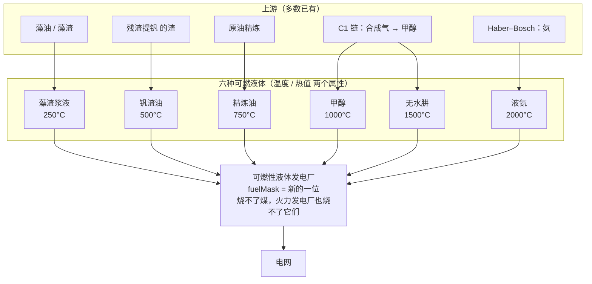
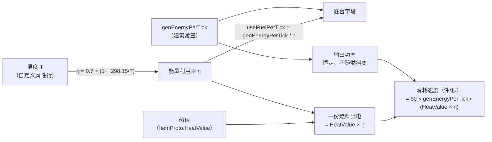

# 可燃液体发电 V1

> 设计稿。数值是第一版,**每一个都标了出处**;实现之前还有三件事只能在游戏里验,列在第八节。
>
> 本文是开发文档,按仓库惯例只有中文。玩家看得见的那部分(物品名、描述、属性行)按双语规矩走
> `i18n.json`,和这份文档无关。

---

## 零、一句话

> **一座只烧可燃液体的发电厂。液体有两个属性——温度和热值——温度决定效率,热值决定一份能烧多久,
> 而这两个属性在现实里就是互不相干的,所以六种液体是六种不同的取舍,不是六个档次。**

---

## 一、它解决什么问题

原版的 **火力发电厂** 是「一个标量」的燃料模型:塞进去什么都一样,只有能烧多久不同。
这条链要做的是把发电这件事拆成**两个可以分别优化的维度**:

- **能量利用率**(一份燃料里有多少真的变成了电)
- **物流吞吐**(为了维持输出,传送带每秒要送几件)

原版这两件事是绑死的。拆开之后,「电网缺电」和「产线缺产能」会指向**不同的燃料**,
这就是这座建筑存在的理由。

它同时给现有产线找了去处:氨(Haber–Bosch)和甲醇(C1 链)目前都只是中间体,
钒渣油可以直接接上已有的 `残渣提钒`。

---

## 二、总览



---

## 三、引擎给的是什么——先读 IL

这一节是整个设计的地基。**结论是:原版不允许「效率随燃料变」,得自己做**;
而做的入口不是补丁,是一个本来就逐台存在的字段。

### 3.1 一份燃料只有一个标量

`PowerGeneratorComponent.EnergyCap_Fuel` 去掉增产剂和两处硬编码之后只有一行:

```
capacityCurrentTick = genEnergyPerTick        // 输出功率 = 建筑常量
```

`GenEnergyByFuel(energy, register)` 扣的是:

```
扣掉的燃料能量 = energy × useFuelPerTick / genEnergyPerTick
```

而一份燃料的能量池由 `SetNewFuel` IL 0027 写入:`fuelHeat = ItemProto.HeatValue`。

把这三行合起来:

| 概念 | 引擎里是什么 | 是谁的属性 |
|---|---|---|
| 输出功率 | `genEnergyPerTick` | **建筑** |
| **能量利用率 η** | `genEnergyPerTick / useFuelPerTick` | **建筑** |
| 一份燃料的总能量 | `HeatValue` | 燃料 |
| 一份能烧多久 | `HeatValue × η / genEnergyPerTick` | 两者 |

**所以原版给一种燃料的只有 `HeatValue` 一个标量。** 温度没有地方放,效率也不随燃料变。

### 3.2 但原版自己破过例,而且破得很难看

`EnergyCap_Fuel` IL 008C 起有两处硬编码:

```
if (fuelMask == 4) {
    if (boost)              capacityCurrentTick *= 100;
    if (curFuelId == 1804)  capacityCurrentTick *= 2;
}
```

**同一座电厂,烧某一个特定物品 ID 就翻倍。** 所以「不同燃料在同一座电厂上表现不同」
并不是引擎排斥的东西,原版只是用了最粗暴的写法,把它写死在一个物品号上。
(1804 是什么离线读不到——物品表在 `resources.assets` 里。从它被 `fuelMask == 4` 圈住看,
属于人造恒星那一类燃料。)

### 3.3 关键:`useFuelPerTick` 是**逐台**字段,不是 prefab 常量

它在 `PowerGeneratorComponent` 上,而这个类型是 **struct**(Cecil 查过 `IsValueType = True`),
存在 `PowerSystem.genPool[]` 里。全程序集扫下来,碰这两个字段的地方是:

```
PowerGeneratorComponent   SetEmpty / Export / Import / EnergyCap_Fuel / GenEnergyByFuel
PowerSystem               NewGeneratorComponent / Import / GameTick
PrefabDesc                ReadPrefab
UIPowerGeneratorWindow    _OnUpdate / OnGeneratorIdChange / OnFuelButtonClick
ItemProto                 GetPropValue
ABN_PowerGenerator        CheckPowerGen / BeforeGameSave          ← 第六节
```

三件事:

1. **逐台写它是合法的**,`EnergyCap_Fuel` 和 `GenEnergyByFuel` 每 tick 都重新读。
2. **它进存档**(在 `Export`/`Import` 里),所以写进去会持久化——这是好事,也意味着
   改了配置之后老存档里的发电厂还带着旧值,需要一条重贴路径(陷阱一的老形状)。
3. **UI 会跟着变**,`UIPowerGeneratorWindow._OnUpdate` 读的就是这两个字段,不用额外补丁。

### 3.4 燃料类型位:一共只有 6 位,但我们只需要 1 位

`ItemProto.InitFuelNeeds` 的循环是:

```
for (mask = 0; mask < fuelNeeds.Length; mask++)
    fuelNeeds[mask] = 所有满足 (mask & proto.FuelType) != 0 的物品 ID
```

而 `ItemProto..cctor` 里是 `fuelNeeds = new int[64][]`。**按掩码值索引,所以合法位只有 bit 0~5**
(值 1/2/4/8/16/32),原版已经占掉低位几个。

这排掉了一个看着很自然的做法:**一个温度一个 bit**。位数不够,而且 bit 是开关不是倍率,
表达不了「效率随温度连续变化」。

**只需要一位**:给六种可燃液体同一个新 `FuelType` 位,电厂的 `fuelMask` 指向它。
于是「火力发电厂烧不了可燃液体、可燃液体发电厂烧不了煤」用原版机制就成立,一行补丁都不用。

LDBTool 会重跑 `InitFuelNeeds`(仓库已记过:mod 燃料只要 `FuelType` + `HeatValue` 就够,
过滤数组是自动重建的),所以这一步不需要像 `RefreshFluidList` 那样自己补一次。

### 3.5 液体当燃料不用验

原版的氢就是这么烧的。`isFluid` 只影响储液罐白名单(`ItemProto.fluids`),
和燃料拾取(`fuelNeeds`)是两条独立的表。

---

## 四、两个属性各落在哪



### 4.1 温度 → 效率:卡诺

```
η(T) = η_II × (1 − T_冷 / T_热)      T_冷 = 298.15 K（25 °C），η_II = 0.7
```

卡诺效率是**温度梯度这个东西的物理含义本身**,不是套上去的公式。
`η_II` 是二级效率(实际效率与卡诺效率之比),真实大型热机在 0.6~0.75。

### 4.2 温度**不是**火焰温度,是这种燃料允许的透平进口温度

这一条是整个设计能成立的关键,也是两个属性得以独立的原因。

**如果温度指绝热火焰温度,这个设计不成立。** 现实里几乎所有烃类在空气中都烧到 1800~2300 °C,
挤成一团,既给不出 250 到 2000 的梯度,也和热值高度相关。

真正能同时解释「梯度」和「独立」的是:

> **温度 = 这种燃料允许的热通道工作温度,受灰分、碱金属、硫、钒造成的积灰与热腐蚀限制。**

这是真实存在的工程约束,而且**和燃烧焓没有因果关系**——污染物含量和能量密度是两回事。
所以那个反相关是真的:

- **重质残渣**能量密度高,但含钒含硫。V₂O₅ 的熔点低于热通道工作温度,熔融后直接攻击热端部件,
  这就是钒致热腐蚀 [1][4][5];沉积与腐蚀速率同时受工作温度与沉积物化学成分支配 [20]。实测数据很硬:一台烧低钒特种燃料的机组,
  **透平进口温度被压到 1375 °F(746 °C)**,即便如此运行 6375 小时后腐蚀依然严重 [2];
  另一组试验给出 5 ppm 钠 + 2 ppm 钒的燃料在 **1500 °F(816 °C)** 金属温度下腐蚀过量 [3]。
- **生物质**的问题更靠前:钾与氯生成低熔点化合物,在过热器上凝结结渣 [11][12][13]——结渣倾向可以直接由灰成分指数预测 [14]。
  一个量化门槛:年生长类生物质的挥发性碱普遍达到 **0.34 kg/GJ 以上**,足以在燃烧中熔融
  或气化后在受热面凝结 [12]。这正是生物质锅炉的蒸汽参数长期上不去的原因 [19]。
- **氨**完全无碳、无灰、无硫,燃烧产物只有 N₂ 和 H₂O,热端没有可沉积的东西 [7][8],
  但它的能量密度是这堆液体里最差的之一——液氨体积能量密度 15.6 MJ/L [10],
  而且层流火焰速度低、难稳燃 [9]。

**一句话:脏的燃料能量密,干净的燃料能量稀。这不是我编的平衡,是这些燃料真实的样子。**

### 4.3 热值 → `HeatValue`

照仓库既有的锚点换算:`MJ_游戏 = 2.7 × (kJ/mol) / 393.5`(原版煤 2.7 MJ ↔ 393.5 kJ/mol)。

---

## 五、数值

### 5.1 效率表

T_冷 = 298.15 K,η_II = 0.7。

| 温度 | T (K) | η 卡诺 | **η = 0.7 η_卡诺** | `useFuelPerTick` 相对 prefab | 浪费掉 |
|---|---|---|---|---|---|
| 250 °C | 523.15 | 0.4301 | **0.3011** | ×2.0202 | 70% |
| 500 °C | 773.15 | 0.6144 | **0.4301** | ×1.4142 | 57% |
| 750 °C | 1023.15 | 0.7086 | **0.4960** | ×1.2261 | 50% |
| 1000 °C | 1273.15 | 0.7658 | **0.5361** | ×1.1345 | 46% |
| 1500 °C | 1773.15 | 0.8319 | **0.5823** | ×1.0445 | 42% |
| 2000 °C | 2273.15 | 0.8688 | **0.6082** | ×1.0000 | 39% |

**prefab 的 `useFuelPerTick` 锚在 2000 °C 这一档**:

```
prefabDesc.useFuelPerTick = genEnergyPerTick / 0.6082 = 1.6442 × genEnergyPerTick
```

理由在第六节。注意 `η_II = 0.7` 这个系数在最右那列里**约掉了**——选绝对卡诺还是乘 0.7,
倍率完全一样,所以第六节那条红线的安全性与 `η_II` 的取值无关。

### 5.2 一个独立的旁证:Curzon–Ahlborn

`η_II = 0.7` 看着像随手取的,拿**内可逆热机在最大功率下的效率**(Curzon–Ahlborn)对一下:

```
η_CA = 1 − √(T_冷 / T_热)
```

| 温度 | η_CA [18] | 本表 0.7η_卡诺 | 比值 |
|---|---|---|---|
| 250 °C | 0.2451 | 0.3011 | 1.228 |
| 500 °C | 0.3790 | 0.4301 | 1.135 |
| 750 °C | 0.4602 | 0.4960 | 1.078 |
| 1000 °C | 0.5161 | 0.5361 | 1.039 |
| 1500 °C | 0.5899 | 0.5823 | 0.987 |
| 2000 °C | 0.6378 | 0.6082 | 0.954 |

**1000 °C 以上两者相差 5% 以内**,这是两个来源完全不同的模型给出的同一条曲线,
0.7 这个系数因此不是拍的。低温端本表比 η_CA 宽松,最多 23%。

**但不能把 η_CA 说成上界,这是一个明确的误用。** [15] 专门指出:η_CA 是
**最大功率点**的效率,不是效率的上界;真实电厂运行在最大功率点以下时效率可以更高,
最大功率效率反而是某一类热机的**下界**。同样的话也适用于 [17] 和低耗散模型 [16]。

### 5.3 全表唯一需要加注的一个数

低耗散模型给出最大功率效率的上界 `η_C/(2−η_C)` [16]。逐档对照:

| 温度 | 本表 η | `η_C/(2−η_C)` | |
|---|---|---|---|
| 250 °C | 0.3011 | 0.2740 | **超出 10%** |
| 500 °C | 0.4301 | 0.4434 | 以下 |
| 750 °C | 0.4960 | 0.5487 | 以下 |
| 1000 °C | 0.5361 | 0.6205 | 以下 |
| 1500 °C | 0.5823 | 0.7121 | 以下 |
| 2000 °C | 0.6082 | 0.7681 | 以下 |

**只有 250 °C 这一档越了线**(交点在 423 °C)。这不算违反——那条界限约束的是
最大功率运行,而真实电厂并不在那个点上 [15]——但它是全表唯一一个需要这句话的数,
记在这里,以后有人重新推的时候不用再推一遍。

### 5.4 六种液体

热值按 §4.3 的锚点换算。**「无固定化学式」那两条是故意的**,和 `残渣提钒` 是同一个处理:
现实里没有配平方程可抄,就说清楚没有,而不是编一个。

| 温度 | 液体 | 温度的依据 | 热值 | 热值的依据 |
|---|---|---|---|---|
| 250 °C | **藻渣浆液** | 碱金属 + 高水分,结渣最严重 [11][12] | ~3.2 MJ | **无固定化学式**,按平衡定,理由见下 |
| 500 °C | **钒渣油** | V₂O₅ 热腐蚀 [1][4][5][6] | ~12.0 MJ | **无固定化学式**,重馏分,按平衡定 |
| 750 °C | **精炼油**(原版) | 含硫馏分;对应 1375 °F 实测限值 [2] | 原版值,不改 | — |
| 1000 °C | **甲醇**(已有) | 无灰无硫,但含碳仍积碳 | 5.0 MJ | 726 kJ/mol,已在表里 |
| 1500 °C | **无水肼** | 产物只有 N₂ 和 H₂O | 4.3 MJ | 622.2 kJ/mol |
| 2000 °C | **液氨**(已有) | 无碳无灰无硫,上限最高 [7][8] | 2.6 MJ | 382.6 kJ/mol |

两头正好是最脏的对最干净的,而热值恰好反过来。**六种液体里有四种上游已经存在**,
只需要新增 藻渣浆液 和 钒渣油。

---

## 六、异常检测这条红线

`ABN_PowerGenerator.CheckPowerGen` 会拿运行时的值和 prefab 比。IL 解出来是:

```csharp
gen = genPool[checkGenId].genEnergyPerTick;
use = genPool[checkGenId].useFuelPerTick;
desc = LDB.items.Select(entityPool[...].protoId).prefabDesc;

if (gen > desc.genEnergyPerTick * 1.5)  → 判异常;
if (desc.useFuelPerTick <= 0)           → 放过;
if (use <  desc.useFuelPerTick * 0.7)   → 判异常;
```

两条约束:

- `genEnergyPerTick` **不得高于 prefab 的 1.5 倍**
- `useFuelPerTick` **不得低于 prefab 的 0.7 倍**

**所以 prefab 必须锚在效率最高的那一档(2000 °C),其余温度只能往上乘。**
反过来做(prefab 放低温档、高温档去减)会在玩家打开电厂窗口时触发异常判定。

按 §5.1 的锚法,运行时的 `useFuelPerTick` 落在 prefab 的 1.000~2.020 倍,
**全程 ≥ prefab,离 0.7 倍那条线有 43% 的余量**;`genEnergyPerTick` 我们根本不改,
1.5 倍那条自然满足。

> 它只检查**玩家当前打开着的那一台**(方法开头读的是
> `UIRoot.instance.uiGame.generatorWindow`),但这不构成放松的理由——
> 玩家迟早会打开一台。

---

## 七、实现要点

### 7.1 在哪里写 `useFuelPerTick`

`PowerGeneratorComponent` 是 **struct**,Harmony 补丁要用 `ref __instance`。
候选钩子有两个,倾向后者:

- `SetNewFuel(itemId, count, inc)` 的后缀——装填燃料时写。语义最准,但只在换料时触发。
- `PowerSystem.GameTick` 里按 `fuelId` 对齐——每 tick 校一次。**但这是 tick 路径**,
  仓库的规矩是不许在上面分配内存,所以温度查表必须是预先建好的 `int[] → float` 数组,
  不能是 `Dictionary` 的装箱查找,更不能有字符串。

无论走哪条,都要有一条**加载后的重贴路径**:`useFuelPerTick` 进存档,
配置改了之后老存档里的发电厂还带着旧值。这和 `AlloyRatioPatches.ReapplyAll` 是同一个形状,
**包括那个教训**——重贴的日志在数量为零时也要打印,否则「没得贴」和「跑早了」分不开。

### 7.2 温度怎么显示

走 `metals.json` / `fieldIdBase` 那一套自定义属性行(`ItemProto.GetPropName` / `GetPropValue`),
和四维金属属性是同一个机制。**记得调 `Translate()`** —— 这正是刚修过的那个坑。

### 7.3 一处 UI 诚实性问题,必须处理

物品提示栏的「燃料热值」显示的是 `HeatValue` 原值,而在这座电厂里玩家实际只拿到
`HeatValue × η`,最好的一档也只有 61%。**这一定会被当成 bug 报上来。**

两条路,建议都做:在液体的描述里写明,并且加一行自定义属性直接给出**在本电厂的实际出电**。

### 7.4 ID 与模型

- **物品 ID**:6624 起是空的(6619–6623 是上一版的活性复合材)。
- **`ERecipeType`**:这座电厂**不需要**新配方类型——它是发电建筑,不是组装机。
  `machines.json` 的 `kind: "generator"` 正好覆盖(克隆一座原版发电建筑,
  只缩放 `genEnergyPerTick` / `useFuelPerTick`)。
- **`modelId`**:708–727 **已经占满了**,而 `ResolveModelId` 是从
  `LDB.models.dataArray.Length + 64 − 1` 向下扫描的,所以新建筑会落到 707 或更低。
  按惯例扫出来之后钉进 JSON。
- **`FuelType`** 的新位:bit 0~5 里挑一个空的,**具体哪个只能运行时 dump**
  ——物品表在 `resources.assets` 里,离线读不到。做法照抄 `OreRegistry.DumpThemes`。

---

## 八、三件要先验的事

按仓库的规矩,写在这里而不是假装已经知道。**第 3 条已经离线解决,前两条挂上了探针。**

### 8.1 ✅ 已解决:`BeforeGameSave` 不判异常

`ABN_PowerGenerator` 除了 `CheckPowerGen` 还有个 `BeforeGameSave` 也读这两个字段。
读完 IL:它遍历 0~29 号异常证据槽,逐条重做和 `CheckPowerGen` 一样的检查,但是——

```
00E3:  bgt.s  → 011B        // gen > prefab × 1.5 → continue
00F2:  ble.s  → 011B        // prefab.useFuelPerTick <= 0 → continue
00F4..0118:  push use, push prefab × 0.7, mul
0119:  pop                  // ← 两个操作数都被丢掉
011A:  pop
011B:  (循环自增)
```

**`useFuelPerTick` 那条比较算完就扔,没有任何分支消费它**;而且方法里所有路径最终都走到
011B,**没有一条调用 `TriggerAbnormality`,也没有一处写字段**。所以它不会判异常。

结论:**红线只由 `CheckPowerGen` 一处执行**,第六节的分析不用改。
(这也说明那条红线只在玩家打开电厂窗口时检查一台,但那不构成放松的理由。)

### 8.2 🔍 探针已就位:`FuelSurvey`

剩下两条都要运行时数据,因为两张表都在 `resources.assets` 里,离线读不到——
和星球主题表是同一种情况,所以做法照抄 `OreRegistry.DumpThemes`:
`src/Patches/Power/FuelSurvey.cs`,挂在 `PostAddDataAction` 上,启动就打。

它回答:

1. **哪个 `FuelType` 位是空的**(见 §7.4)。按 `FuelType` **值**分组而不是按位分组——
   一个物品的 `FuelType` 理论上可以是多位组合,按位分组会把它数两次。最后报
   `已用位掩码` 和空位列表。
2. **原版烧燃料的发电厂效率是多少。** 逐座 `isPowerGen` 的 prefab 报
   `genEnergyPerTick` / `useFuelPerTick` / 两者之比 / `fuelMask`,
   外加 `ABN 下限 useFuelPerTick ≥ prefab × 0.7`,直接就是第六节那条红线的参照物。
   火力发电厂看着是 1:1(煤 2.7 MJ ÷ 2.16 MW = 1.25 s),但那是从面板数字倒推的,
   不是读出来的。

两段都在「什么都没找到」时打 WARNING 而不是静默——仓库为这条规矩已经付过三次代价。

**它是永久的,不是临时脚手架。** 理由和 `DumpThemes` 一样:这两张表唯一的事实来源
就是跑起来的 `LDB`,而且游戏更新会改动它们。

---

## 九、最需要在游戏里标定的东西:效率轴的代价

**这是 V1 最弱的地方,写在这里免得以后当成已解决。**

按 §5.4 的数值,钒渣油(12.0 MJ × 0.430 = 5.16 MJ/件)对液氨(2.6 MJ × 0.608 = 1.58 MJ/件),
**单件出电差 3.3 倍**。也就是说:

> 光看这张表,「低温高热值」严格占优——它每件出电更多,传送带压力更小,
> 浪费掉的那 57% 在游戏里**不花任何代价**。

因为 DSP 的瓶颈是**件/秒**,不是焦耳。能量利用率只有在**上游成本跟燃料的化学能挂钩**时
才变成真实决策。所以两件事必须在标定时一起定:

- **每种液体的生产成本要大致随热值走。** 钒渣油一件要贵到能抵掉它浪费的那一半。
- **或者反过来用物流做刹车**:液氨每件出电少,意味着同样功率下要喂 3.3 倍的件数——
  如果电厂的输入口数量有限,这本身就是硬约束。

第二条更干净,因为它不依赖玩家算账。倾向于**先把 `genEnergyPerTick` 定得足够大**,
让高热值燃料也必须多路供应,再看件/秒的差距够不够构成取舍。

另外记一笔第二个选择带来的后果:顶格 η = 0.61 **低于原版火力发电厂**(看着是 1.0)。
这是有意选的,但它意味着这座建筑的卖点**不能是效率**,只能是:

- **功率密度**——一座顶几十座火力发电厂,省下的是占地、电网接口和建造件数
- **烧的是产线本来就在往外排的东西**——原料机会成本近乎零时,效率低不构成问题

这两条都要在 `mod特性.md` / `mod_feature.md` 里说清楚,否则玩家会算出「不如烧煤」。

---

## 十、参考文献

**钒致热腐蚀与热通道温度限制**

1. Selim et al. 2024. *Water-Based Yttrium Additive for Hot Corrosion Inhibition in a Gas Turbine.* ASME Turbo Expo. DOI: 10.1115/gt2024-127690
2. Hussey et al. 2009. *Operation of Gas Turbines on ASTM 3-GT Fuel.* ASTM STP. DOI: 10.1520/stp36510s
3. Lee et al. 1971. *Laboratory Procedures for Evaluating High-Temperature Corrosion Resistance of Gas Turbine Alloys.* Journal of Engineering for Power. DOI: 10.1115/1.3445582
4. Patarini et al. 1979. *Hot Corrosion of Gas Turbine Components.* Journal of Engineering for Power. DOI: 10.1115/1.3446441
5. Rocca et al. 2001. *Revisiting the Inhibition of Vanadium-Induced Hot Corrosion in Gas Turbines.* J. Eng. Gas Turbines Power. DOI: 10.1115/1.1456095
6. Wong-Moreno et al. 1996. *Erosion, Corrosion and Deposits in Gas Turbines Burning Heavy, High Sulphur Fuel Oil.* Corrosion Reviews. DOI: 10.1515/corrrev.1996.14.3-4.265
20. Kulkarni et al. 2019. *Component Level Hot Corrosion and Deposit Modeling for Large Gas Turbines.* EPRI/123HiMAT. DOI: 10.31399/asm.cp.am-epri-2019p0783

**氨作为无碳燃料**

7. Kobayashi et al. 2018. *Science and technology of ammonia combustion.* Proceedings of the Combustion Institute. DOI: 10.1016/j.proci.2018.09.029
8. Yao et al. 2024. *The advancement on carbon-free ammonia fuels for gas turbine: A review.* Energy Conversion and Management. DOI: 10.1016/j.enconman.2024.118745
9. Valera-Medina et al. 2016. *Ammonia–methane combustion in tangential swirl burners for gas turbine power generation.* Applied Energy. DOI: 10.1016/j.apenergy.2016.02.073
10. Kurien et al. 2022. *Review on the production and utilization of green ammonia as an alternate fuel in dual-fuel compression ignition engines.* Energy Conversion and Management. DOI: 10.1016/j.enconman.2021.114990

**生物质碱金属结渣**

11. Niu et al. 2016. *Ash-related issues during biomass combustion.* Progress in Energy and Combustion Science. DOI: 10.1016/j.pecs.2015.09.003
12. Miles et al. 1996. *Boiler deposits from firing biomass fuels.* Biomass & Bioenergy. DOI: 10.1016/0961-9534(95)00067-4
13. Mlonka-Mędrala et al. 2020. *Alkali metals association in biomass and their impact on ash melting behaviour.* Fuel. DOI: 10.1016/j.fuel.2019.116421
14. Lachman et al. 2021. *An overview of slagging and fouling indicators and their applicability to biomass fuels.* Fuel Processing Technology. DOI: 10.1016/j.fuproc.2021.106804
19. Ke et al. 2022. *Development of biomass-fired circulating fluidized bed boiler with high steam parameters.* Journal of the Energy Institute. DOI: 10.1016/j.joei.2022.10.011

**有限时间热力学(§5.2 / §5.3 的旁证与那条不能误用的界限)**

15. Chen et al. 2001. *On the Curzon–Ahlborn efficiency and its connection with the efficiencies of real heat engines.* Energy Conversion and Management. DOI: 10.1016/s0196-8904(00)00055-8
16. Esposito et al. 2010. *Efficiency at maximum power of low-dissipation Carnot engines.* Physical Review Letters. DOI: 10.1103/physrevlett.105.150603
17. Gordon 1990. *Observations on efficiency of heat engines operating at maximum power.* American Journal of Physics. DOI: 10.1119/1.16175
18. Zhao et al. 2024. *Revisiting Endoreversible Carnot Engine: Extending the Yvon Engine.* Entropy. DOI: 10.3390/e27020195
