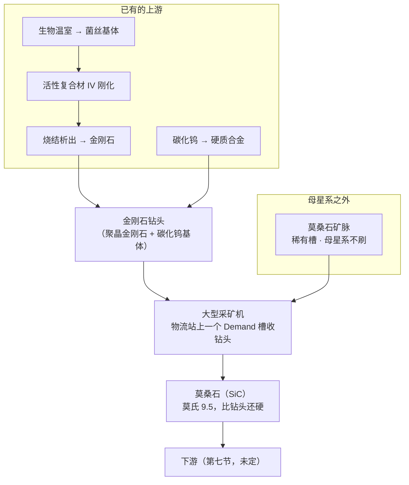

# 外星矿脉 V1 · 莫桑石

> 设计稿。数值是第一版,**每一个都标了出处**;还没进配置,也还没进游戏验。
>
> 本文是开发文档,按仓库惯例只有中文。玩家看得见的部分按双语规矩走 `i18n.json`。

---

## 零、一句话

> **一种只在母星系之外才找得到的矿脉,硬到比钻头本身还硬——挖它要消耗钻头。**
> 「外星系」「极稀有」「吃钻头」这三条不是三个设定,是**同一种真实矿物的三个属性**。

---

## 一、它解决什么问题

这个 mod 的大型采矿机已经拉到 200,000/秒,**而且没有任何运行成本**。想给它加个消耗,
最直接的做法是让所有采矿都吃钻头——但那是对现存存档的削弱,还得配开关、还得考虑
没料时降速还是停机。

**换个做法:不动现有的矿,新开一种矿脉,只有它吃钻头。**

- 新矿脉只在**尚未生成**的星球上出现,老工厂一台机器都不受影响 → **不需要开关**
- 因为不存在「本来在跑、突然停了」,**没钻头直接停机**就是可以接受的,不用做降速那套折中
- 速度已经拉满,这条链加的是**深度**不是数字

---

## 二、总览



---

## 三、为什么是莫桑石——三条依据都是真的

**这是整份设计的地基。** 「外星」「稀有」「吃钻头」通常要靠三个各自独立的设定去凑,
而莫桑石一个矿物同时满足三条,**而且都是现实**。

### 3.1 它真的来自别的恒星

陨石里的碳化硅是**前太阳系颗粒**:它们凝结于**比太阳更早死去的恒星的星风之中**,
在太阳系形成之前就已经存在 [1][2]。其中约 90%(主流型与 Y、Z 型)来自
**低质量的碳星(AGB 星)**,还有一小群 X 型带着超新星的同位素指纹 [1][2][3]。

更妙的是:**不同的颗粒类型对应不同母星的质量与金属丰度** [5][6][8][9]。
Y 型和 Z 型来自金属丰度低于太阳的恒星 [4][6][8],而特别大的颗粒反而指向
**比太阳更富金属**的 AGB 星 [7]。「换个星系挖到的东西不一样」在现实里就是这么回事——
这条本 V1 不做,但它是现成的扩展方向,记在第七节。

**所以「母星系找不到」不是平衡设定,是矿物学。**

### 3.2 它真的极其稀有

原始陨石里的前太阳系碳化硅含量是**百万分之几**量级 [3]。而地球上的天然莫桑石
少到可以忽略——亨利·莫瓦桑 1893 年在亚利桑那魔鬼峡谷陨石坑里第一次发现它,
起初以为是金刚石。

### 3.3 它真的吃钻头,而且**比钻头还硬**

这一条是整条机制的支点,而且推导链完整:

| 环节 | 依据 |
|---|---|
| 莫氏硬度 → 磨蚀性(Cerchar 指数 CAI) | CAI 是评价岩石磨蚀性最通用的方法 [18],而**它与莫氏硬度有良好相关** [13] |
| CAI → 钻头磨损 | CAI 是预测刀具磨损最主要的单一参数,与钻头磨损的相关系数 **R² = 0.954** [10] |
| 磨损的增长形态 | **随 UCS、CAI、石英当量含量呈指数增长** [10];钻头寿命随 CAI 上升而下降 [11][12],盘刀磨损也有基于 CAI 的定量模型 [19] |
| 尺度感 | CAI > 2 已属「中到高磨蚀」,而 86% 的火成岩落在这一档 [16] |

而莫桑石的位置是:

```
莫氏硬度    石英 7  <  硬质合金钻头 ≈ 9  <  莫桑石 9.5  <  金刚石 10
维氏硬度    石英 ~1100   碳化钨 ~2600   碳化硅 ~2800   金刚石 ~10000
```

**它比碳化钨钻头本身还硬。** 这不是「磨得快一点」,是**工具压不动岩石**——
现实里对付这种硬度的岩石只有一条路:**上金刚石工具**。这直接决定了第五节的钻头是什么。

> **一条要诚实说明的限制。** Cerchar 试验本身就受压针硬度、试样表面状态、操作手法影响 [15],
> 而 [17] 更进一步指出:磨蚀性试验作为刀具寿命的模拟手段,
> **不能可靠地从岩石的物理力学性质反推**,由此得到的关系式要谨慎使用。
> 所以本设计用这些文献支撑的是**定性的方向**(硬 → 磨蚀 → 吃钻头,且呈指数),
> **不是**某个具体的「一个钻头挖多少矿」。那个数是平衡旋钮,见 §5.3。

---

## 四、引擎侧:几乎不用新机制

### 4.1 稀有度与「母星系不刷」是原版数据槽

`RareSettings` 步长为 4,`[i*4+1]` 就是 `star.index == 0`(母星系)时用的概率——
**填 0 就是母星系不刷**。`ores.json` 的 `placement.birthSystem: false` 已经在用它,
钒和钨都是这么配的。不用补丁。

矿脉类型取 **23**:当前最大是 22(白钨矿),而 **ID 必须连续**——
`UIPlanetDetail.OnPlanetDataSet` 会先读 `veinProto.MiningItem` 再判空,留洞会让星球面板空引用。
`OreRegistry.VerifyContiguous` 会在不连续时大声失败。

### 4.2 钻头往哪放:采矿机自带物流站

`MinerComponent` 一个原料槽都没有,只有 `productId` / `productCount` 输出缓冲。
但 `UIGame.OnPlayerInspecteeChange` 里这一句是关键:

```
IL 02F2:  if (minerId != 0 && stationId == 0) OpenMinerWindow();
```

**采矿机窗口只在 `stationId == 0` 时才开。** 而大型采矿机是 `isVeinCollector`、
**自带 `StationComponent`**,所以点它开的是**物流站窗口**(内嵌 `UIVeinCollectorPanel`)。

> **所以钻头槽就是物流站上一个设成 Demand 的储物格,无人机自动送货,零新界面。**

本 mod 每 tick 已经在改那个 `station.storage[]` 和 `collectionIds[]` 了
(`AdvancedMinerPatches.SyncStationStorage`),槽位维护直接加在那里。

### 4.3 判定只挂在这一种矿脉上

停机判定加在已有的 `MinerComponent.InternalUpdate` 前缀里,条件是
`veinPool[veins[currentVeinIndex]].type == 23`。

**所以对现存存档零影响**,也不需要配置开关——老档里根本没有这种矿脉。

### 4.4 两件要进游戏验的

- **大型采矿机的物流站有几个储物格?** 至少要 2 个(矿 + 钻头)。现在
  `StationCapacityPatches` 的格数提升按 `isCollectStation` 判,那是**气体采集器**,
  **没覆盖 `isVeinCollector`**,所以采矿机多半还是原版格数。
- **`StationComponent.Init` 或 `UpdateVeinCollection` 会不会把多出来的那一格冲掉。**

两条都只能运行时查,做法照抄 `FuelSurvey` / `ProliferatorSurvey`。

---

## 五、钻头

### 5.1 为什么是金刚石,而不是活性复合材

初步想法是用**活性复合材**做钻头——硬度换挖速、韧性换寿命,钻头正是这个权衡的
教科书案例。**但 §3.3 把这条否了**:莫桑石比碳化钨还硬,活性复合材最硬的那一级
(IV 刚化,硬度 82)连碳化钨(95)都不到,**压根压不动它**。

现实里对付这个硬度只有金刚石。而**本 mod 已经有金刚石**——
`活性复合材 IV · 烧结析出 → 金刚石`。所以链条是通的,而且不用新物品:

```
菌丝基体 + 合金 → 活性复合材 IV → 烧结析出 → 金刚石 → 金刚石钻头
```

这顺带给活性复合材 IV **又一个去处**,而且是个吃量的去处。

### 5.2 配方:PDC 钻头

**聚晶金刚石复合片(PDC)钻头的真实构造就是「金刚石层 + 碳化钨基体」**——
金刚石负责切削,碳化钨负责撑住它并焊上钻杆。两样本 mod 都有:

```
金刚石 ×N + 硬质合金 ×M  →  金刚石钻头
```

配比按「金刚石是薄薄一层、基体是本体」定,所以**硬质合金用量应当明显多于金刚石**。
具体数见 §6。

> **不构成自举。** 钻头不含碳化硅——金刚石来自生物链 + 合金,硬质合金来自钨。
> 两条都不需要先有莫桑石。

### 5.3 消耗速率怎么定——以及它为什么是个旋钮

真实的钻头寿命以「米/钻头」计 [14],而这个游戏里没有「米」。
最接近游戏所需口径的是 **SAR(单位岩石去除量对应的刀具磨损)** [20]——
正好就是「挖掉这么多矿,磨掉多少钻头」;但它同样是**实测量**,不是从硬度算出来的。
而且 [17] 明确说了磨蚀性到刀具寿命的换算**不能从岩石性质可靠反推**。

**所以「一个钻头挖多少矿」是平衡旋钮,不是推出来的数**——和 `stackSize` 一样,
这一点写在配置的 `//` 里,不假装它有物理依据。

文献能支撑的只有**形态**:磨损随磨蚀性**指数增长** [10]。所以如果以后要加第二种、
第三种吃钻头的矿,它们之间的消耗比应当是指数的而不是线性的。这一条记下来。

---

## 六、数值(第一版)

### 6.1 矿脉

| 字段 | 取值 | 依据 |
|---|---|---|
| `veinId` | **23** | 当前最大 22,ID 必须连续 |
| `placement.mode` | `rare` | 稀有槽,「一颗星要么有要么没有」 |
| `placement.birthSystem` | `false` | 母星系不刷——§3.1 |
| `placement.chance` | **0.02** | 低于钒(0.06)与钨(0.09)。**它是全表最稀有的一种**,而且和钨不同,它没有合成后路也不该有 |
| `placement.themes` | 待定 | 主题表在 `resources.assets` 里,**只能看启动日志的 `DumpThemes`**。倾向于无大气/受撞击的主题 |
| `veinRarity` | 4.0 | 和钒/钨同档(GalacticScale 换算用) |

### 6.2 矿石

| 字段 | 取值 | 依据 |
|---|---|---|
| 名称 | 莫桑石 | 莫瓦桑 1893 年发现于陨石坑 |
| `hasIngot` | 待定 | 碳化硅不冶炼成金属,见 §7 |
| 四维属性 · 硬度 | **96** | 碳化硅约 2800 HV;`metals.json` 里碳化钨 95 对应「约 2600 HV」,同一把尺 |
| 四维属性 · 韧性 | **8** | 陶瓷,断裂韧度极低;碳化钨是 10,它更脆 |
| 四维属性 · 耐蚀 | **92** | 化学惰性极强,耐酸碱、耐高温氧化 |
| 四维属性 · 导电 | **18** | 宽禁带半导体:本征绝缘,掺杂后导电——比碳化钨(12)略高 |

> 碳化硅**不是金属,但用同一套轴**——`metals.json` 里碳化钨已经是这么处理的,
> 理由一样:要参与混合律计算就得有这一行。

### 6.3 钻头(待标定)

| | 第一版 | 说明 |
|---|---|---|
| 配方 | 金刚石 ×1 + 硬质合金 ×4 → 金刚石钻头 ×1 | 基体用量明显多于金刚石——PDC 的真实构造 |
| 一个钻头能挖 | **待定** | §5.3:这是旋钮,不是推导 |

---

## 七、还没定的

1. **莫桑石的下游是什么?** 碳化硅现实中的三大去处:磨料、**高温大功率半导体**、
   **陶瓷基复合材料**。倾向后两者——SiC 陶瓷基复合材料是真实在役的航空发动机热端材料,
   可以接到可燃液体发电厂上去抬那个温度上限(比之前设想的活性复合材更站得住)。
   **磨料那条要绕开**:会形成「要钻头才能挖、挖出来做钻头」的自举。
2. **要不要分钻头等级。** 分级要在物流站窗口里加面板,是新 UI;不分级零 UI。
   倾向 V1 不分。
3. **「不同星系挖到的颗粒类型不同」要不要做。** §3.1 说了这在现实里是成立的
   (Y/Z 型来自低金属丰度恒星 [4][6][8],大颗粒来自富金属 AGB 星 [7])。
   做法上可以按恒星的某个属性决定产物,但那是一套新机制,不在 V1。
4. **主题分布**要等 `DumpThemes` 的日志。
5. **§4.4 那两条**(储物格数、会不会被冲掉)要先探针问清楚再动手。

---

## 八、参考文献

**前太阳系碳化硅颗粒(§3.1、§3.2)**

1. Zinner 1998. *Stellar Nucleosynthesis and the Isotopic Composition of Presolar Grains from Primitive Meteorites.* Annual Review of Earth and Planetary Sciences. DOI: 10.1146/annurev.earth.26.1.147
2. Liu et al. 2022. *Slow Neutron-Capture Process: Low-Mass Asymptotic Giant Branch Stars and Presolar Silicon Carbide Grains.* Universe. DOI: 10.3390/universe8070362
3. Hoppe et al. 1997. *Mainstream silicon carbide grains from meteorites.* DOI: 10.1063/1.53314
4. Hoppe et al. 1997. *Meteoritic Silicon Carbide Grains with Unusual Si-Isotopic Compositions: Evidence for an Origin in Low-Mass, Low-Metallicity AGB Stars.* ApJL. DOI: 10.1086/310869
5. Liu et al. 2019. *Presolar Silicon Carbide Grains of Types Y and Z: Their Molybdenum Isotopic Compositions and Stellar Origins.* ApJ. DOI: 10.3847/1538-4357/ab2d27
6. Liu et al. 2022. *Presolar silicon carbide grains of types Y and Z: their strontium and barium isotopic compositions and stellar origins.* Eur. Phys. J. A. DOI: 10.1140/epja/s10050-022-00838-z
7. Lugaro et al. 2020. *Origin of Large Meteoritic SiC Stardust Grains in Metal-rich AGB Stars.* ApJ. DOI: 10.3847/1538-4357/ab9e74
8. Amari et al. 2001. *Presolar SiC Grains of Type Y: Origin from Low-Metallicity Asymptotic Giant Branch Stars.* ApJ. DOI: 10.1086/318230
9. Boujibar et al. 2020. *Cluster Analysis of Presolar Silicon Carbide Grains.* ApJL. DOI: 10.3847/2041-8213/abd102

**岩石磨蚀性与钻头磨损(§3.3、§5.3)**

10. Kalhori et al. 2023. *Wear Prediction of Rock Drill Bits Based on Geomechanical Properties of Rocks.* Arabian Journal for Science and Engineering. DOI: 10.1007/s13369-023-08598-8
11. Capik et al. 2017. *Correlation between Cerchar abrasivity index, rock properties, and drill bit lifetime.* Arabian Journal of Geosciences. DOI: 10.1007/s12517-016-2798-7
12. Capik et al. 2021. *Development models for the drill bit lifetime prediction and bit wear types.* Int. J. Rock Mechanics and Mining Sciences. DOI: 10.1016/j.ijrmms.2021.104633
13. Kaspar et al. 2023. *Hardness, strength and abrasivity of rocks: Correlations and predictions.* Geomechanics and Tunnelling. DOI: 10.1002/geot.202200007
14. Majeed et al. 2019. *Abrasivity evaluation for wear prediction of button drill bits using geotechnical rock properties.* Bulletin of Engineering Geology and the Environment. DOI: 10.1007/s10064-019-01587-y
15. Rostami et al. 2014. *Study of Dominant Factors Affecting Cerchar Abrasivity Index.* Rock Mechanics and Rock Engineering. DOI: 10.1007/s00603-013-0487-3
16. Di Giovanni et al. 2023. *A statistical approach for the correlation between Cerchar Abrasivity Index and Uniaxial Compressive Strength of rocks.* Geomechanics and Tunnelling. DOI: 10.1002/geot.202200015
17. Hamzaban et al. 2024. *A Critique on the Correlations Between Rock Abrasiveness, Hardness, and Mechanical Characteristics.* Rock Mechanics and Rock Engineering. DOI: 10.1007/s00603-024-04184-y
18. Zhang et al. 2025. *Cerchar abrasivity test and its applications in rock engineering: A review.* Int. J. Coal Science & Technology. DOI: 10.1007/s40789-024-00731-8
19. Sun et al. 2023. *A new prediction model for disc cutter wear based on Cerchar Abrasivity Index.* Wear. DOI: 10.1016/j.wear.2023.204927
20. Li et al. 2024. *Study of Cerchar abrasive parameters of monomineralic rocks and its application for evaluating cutting efficiency.* Int. J. Rock Mechanics and Mining Sciences. DOI: 10.1016/j.ijrmms.2024.105895
