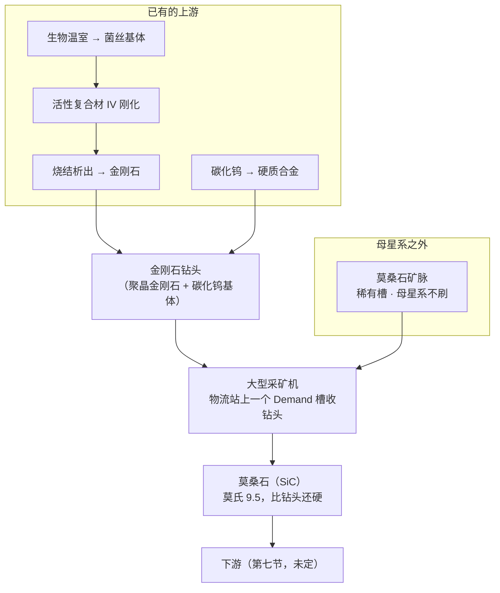

# 外星矿脉 V1 · 莫桑石

> 设计稿。数值是第一版,**每一个都标了出处**;还没进配置,也还没进游戏验。
>
> 本文是开发文档,按仓库惯例只有中文。玩家看得见的部分按双语规矩走 `i18n.json`。

---

## 零、一句话

> **一种只在母星系之外才找得到的矿脉,硬到比钻头本身还硬——挖它要消耗钻头。**
> 「外星系」「极稀有」「吃钻头」这三条不是三个设定,是**同一种真实矿物的三个属性**。

---

## 一、它解决什么问题

这个 mod 的大型采矿机已经拉到 200,000/秒,**而且没有任何运行成本**。想给它加个消耗,
最直接的做法是让所有采矿都吃钻头——但那是对现存存档的削弱,还得配开关、还得考虑
没料时降速还是停机。

**换个做法:不动现有的矿,新开一种矿脉,只有它吃钻头。**

- 新矿脉只在**尚未生成**的星球上出现,老工厂一台机器都不受影响 → **不需要开关**
- 因为不存在「本来在跑、突然停了」,**没钻头直接停机**就是可以接受的,不用做降速那套折中
- 速度已经拉满,这条链加的是**深度**不是数字

---

## 二、总览



---

## 三、为什么是莫桑石——三条依据都是真的

**这是整份设计的地基。** 「外星」「稀有」「吃钻头」通常要靠三个各自独立的设定去凑,
而莫桑石一个矿物同时满足三条,**而且都是现实**。

### 3.1 它真的来自别的恒星

陨石里的碳化硅是**前太阳系颗粒**:它们凝结于**比太阳更早死去的恒星的星风之中**,
在太阳系形成之前就已经存在 [1][2]。其中约 90%(主流型与 Y、Z 型)来自
**低质量的碳星(AGB 星)**,还有一小群 X 型带着超新星的同位素指纹 [1][2][3]。

更妙的是:**不同的颗粒类型对应不同母星的质量与金属丰度** [5][6][8][9]。
Y 型和 Z 型来自金属丰度低于太阳的恒星 [4][6][8],而特别大的颗粒反而指向
**比太阳更富金属**的 AGB 星 [7]。「换个星系挖到的东西不一样」在现实里就是这么回事——
这条本 V1 不做,但它是现成的扩展方向,记在第七节。

**所以「母星系找不到」不是平衡设定,是矿物学。**

### 3.2 它真的极其稀有

原始陨石里的前太阳系碳化硅含量是**百万分之几**量级 [3]。而地球上的天然莫桑石
少到可以忽略——亨利·莫瓦桑 1893 年在亚利桑那魔鬼峡谷陨石坑里第一次发现它,
起初以为是金刚石。

### 3.3 它真的吃钻头,而且**比钻头还硬**

这一条是整条机制的支点,而且推导链完整:

| 环节 | 依据 |
|---|---|
| 莫氏硬度 → 磨蚀性(Cerchar 指数 CAI) | CAI 是评价岩石磨蚀性最通用的方法 [18],而**它与莫氏硬度有良好相关** [13] |
| CAI → 钻头磨损 | CAI 是预测刀具磨损最主要的单一参数,与钻头磨损的相关系数 **R² = 0.954** [10] |
| 磨损的增长形态 | **随 UCS、CAI、石英当量含量呈指数增长** [10];钻头寿命随 CAI 上升而下降 [11][12],盘刀磨损也有基于 CAI 的定量模型 [19] |
| 尺度感 | CAI > 2 已属「中到高磨蚀」,而 86% 的火成岩落在这一档 [16] |

而莫桑石的位置是:

```
莫氏硬度    石英 7  <  硬质合金钻头 ≈ 9  <  莫桑石 9.5  <  金刚石 10
维氏硬度    石英 ~1100   碳化钨 ~2600   碳化硅 ~2800   金刚石 ~10000
```

**它比碳化钨钻头本身还硬。** 这不是「磨得快一点」,是**工具压不动岩石**——
现实里对付这种硬度的岩石只有一条路:**上金刚石工具**。这直接决定了第五节的钻头是什么。

> **一条要诚实说明的限制。** Cerchar 试验本身就受压针硬度、试样表面状态、操作手法影响 [15],
> 而 [17] 更进一步指出:磨蚀性试验作为刀具寿命的模拟手段,
> **不能可靠地从岩石的物理力学性质反推**,由此得到的关系式要谨慎使用。
> 所以本设计用这些文献支撑的是**定性的方向**(硬 → 磨蚀 → 吃钻头,且呈指数),
> **不是**某个具体的「一个钻头挖多少矿」。那个数是平衡旋钮,见 §5.3。

---

## 四、引擎侧:几乎不用新机制

### 4.1 稀有度与「母星系不刷」是原版数据槽

`RareSettings` 步长为 4,`[i*4+1]` 就是 `star.index == 0`(母星系)时用的概率——
**填 0 就是母星系不刷**。`ores.json` 的 `placement.birthSystem: false` 已经在用它,
钒和钨都是这么配的。不用补丁。

矿脉类型取 **23**:当前最大是 22(白钨矿),而 **ID 必须连续**——
`UIPlanetDetail.OnPlanetDataSet` 会先读 `veinProto.MiningItem` 再判空,留洞会让星球面板空引用。
`OreRegistry.VerifyContiguous` 会在不连续时大声失败。

### 4.2 钻头往哪放:采矿机自带物流站

`MinerComponent` 一个原料槽都没有,只有 `productId` / `productCount` 输出缓冲。
但 `UIGame.OnPlayerInspecteeChange` 里这一句是关键:

```
IL 02F2:  if (minerId != 0 && stationId == 0) OpenMinerWindow();
```

**采矿机窗口只在 `stationId == 0` 时才开。** 而大型采矿机是 `isVeinCollector`、
**自带 `StationComponent`**,所以点它开的是**物流站窗口**(内嵌 `UIVeinCollectorPanel`)。

> **所以钻头槽就是物流站上一个设成 Demand 的储物格,无人机自动送货,零新界面。**

本 mod 每 tick 已经在改那个 `station.storage[]` 和 `collectionIds[]` 了
(`AdvancedMinerPatches.SyncStationStorage`),槽位维护直接加在那里。

### 4.3 判定只挂在这一种矿脉上

停机判定加在已有的 `MinerComponent.InternalUpdate` 前缀里,条件是
`veinPool[veins[currentVeinIndex]].type == 23`。

**所以对现存存档零影响**,也不需要配置开关——老档里根本没有这种矿脉。

### 4.4 两个未知数,都答完了

`MinerStationSurvey` 跑过一次,加上离线读 IL,两条都有答案。

**问题一:采矿机的物流站有几格?**

```
prefab:  大型采矿机(2316)  stationMaxItemKinds = 1   每格容量 10,000,000
标志:    isVeinCollector=True  isStation=True  isCollectStation=False
实况:    storage 长度 1，储物格 0 = 煤矿(Supply, 10005000/10005000)，空格 0 个
```

**只有一格,而且被矿占满。** 所以钻头槽必须靠抬高 `stationMaxItemKinds` 来腾,
抬到 **2** 就够——**别抬到 30**,多出来的空格会把 30 格的物流站界面拖到采矿机上来
(气体采集器那条老教训)。

**它现在没被 `StationCapacityPatches` 改过,但原因不是标志。** 采矿机的 `isStation`
其实是 `true`,过得了那边 `Apply()` 的守卫;真正的原因是 **`Apply()` 只对一份固定名单
调用**(stations.json 的 `itemIds`、巨型建筑、machines.json 里 kind 为 station 的,
外加按 `isCollectStation` 发现的采集器),采矿机一个都不在里面。

> 探针的头一版就是按标志推的,报出「覆盖得到它」而实测是 1 格,**结论正好反了**。
> 这是仓库那条老规矩的又一次应验:**验最终状态,不验自己那一步。** 已经改成
> 拿 `stations.json` 要的格数和实测值对比再下结论。

**问题二:多出来的那一格会不会被冲掉?不会。** 三条都是离线读出来的:

| 位置 | 结论 |
|---|---|
| `Init` IL 01B5 | `storage = new StationStore[_desc.stationMaxItemKinds]`——**数组长度就是这个字段** |
| `Init` 的两个填充循环(IL 0344 气体、IL 0420 矿脉) | **都只跑到 `collectionIds.Length`**,并以 `i > stationMaxItemKinds - 1` 提前跳出,超出矿种数的格子不会被写 |
| `UpdateVeinCollection` | 全方法 174 条指令,每一处 `ldelema StationStore` 前面都是 `ldc.i4.0`——**只碰 `storage[0]`** |

**这张表预测对了,但少说了一句,而少的那一句就是后来真出的 bug。**
表里写的是「超出矿种数的格子不会被写」,读起来像是「那一格是空的」;
实际上没被写过的 `StationStore` 留在默认值,**`max` 是 0——容量为零,什么都装不下**。
玩家看到的不是「有一格空着」,而是「采矿机上压根没有能用的钻头槽」。

实测日志(第三轮)把这件事摆得很清楚:

```
实体 16 / 站点 6，storage 长度 2，collectionIds 长度 1，isVeinCollector=True
  储物格 0：铁矿(1001) 本地 Supply 远程 None 数量 546666/10005000
  储物格 1：（空） 本地 None 远程 None 数量 0/0
```

数组**确实**是 2 格——`stationMaxItemKinds` 抬对了。容量却是 0。
**「格子数够了」不等于「格子能用」**,而中间这一步没有任何东西会报错。
所以本 mod 得自己把这一格布置出来:给容量、指定物品、设成 Demand,
见 `AlienVeinPatches.EnsureBitSlot`。两个附带结论:

- **容量要单独配,不能抄第 0 格。** 第 0 格已经被 `StationCapacityPatches` 放大到
  1000 万,而本地 Demand 槽是照着 `max` 要货的——抄过来就是第一台采矿机向物流网
  索要一千万个钻头,把后面每一台饿死。症状会是「我别的采矿机全停了」,
  离真正的原因很远。默认囤 3000 个(满速约 12 分钟的量)。
- **写完要调 `RefreshStationTraffic`。** 需求表是它建的,只写 `localLogic` 不刷表,
  运输机不知道这里要货。它要遍历整颗星球的物流站,所以只在真改了的时候调。

### 4.5 由此定下来的一件事:只对新建的采矿机有效

`storage` 在**建造时**就按当时的 `stationMaxItemKinds` 固化进存档了(陷阱一),
所以抬高 prefab **只影响之后新建的采矿机**,老机器手里还是 1 格。

**这对本设计不构成问题**:莫桑石矿脉只出现在尚未生成的星球上,玩家在它上面建的
每一台采矿机都是新的。所以**不需要**像 `StationExpandPatches` 那样在读档时给存量
站点扩数组——那条路存在(有先例),但这里用不上。

---

## 五、钻头:一个物品,和一个在注册时展开的谓词

### 5.1 谓词用在两个地方,用法不同

`CLAUDE.md` 的「已知缺口」里记着一条:**谓词驱动的配方必须在注册时展开成一条条
具体配方,不能运行时求值**——因为 `RecipeProto.Items` 是 `int[]`,表达不了「任何
硬度 ≥ 70 的材料」,而且运行时钩子还得骗过分拣器插入、`UpdateNeeds` 和已经进了存档的值。

**但钻头不走配方。** 它是我们自己的消耗逻辑,物流站槽里放着什么、四维是多少,
每 tick 都读得到。所以**那条约束在这里不适用**,可以直接对槽里的东西求值。

> 这是本仓库第一次真正用上谓词。**它没有落在配方上,所以躲开了那条限制。**

> **但这条只对「消耗」成立,对「配方」不成立。** 一旦要让玩家<b>合成</b>钻头,
> 谓词就落回配方上了,那条限制立刻回来。所以本设计把谓词用在两个地方、用法不同:
>
> | 用在哪 | 怎么求值 | 为什么 |
> |---|---|---|
> | 采矿机消耗钻头 | 不需要谓词了——槽里只认「钻头」一个物品 | 见 §5.3 |
> | **合成钻头的配方** | **注册时展开成一条配方一种材料** | `RecipeProto.Items` 是 `int[]` |

**所以钻头是一个实实在在的物品,而且它只有一种。** 变的是<b>做一个要投多少料</b>:

```
投料数 = ceil(capacity / 该材料的产量)
```

`capacity` 取自合格材料里**最高**的那个产量,所以最好的材料投 1 个——
**那是算出来的,不是定出来的**。

这样做的好处,比「把原材料直接塞进钻头槽」多三条:

- **可发现。** 物品栏里有「钻头」、合成面板里每种材料各占一格,玩家一眼知道要干什么。
  原来那个设计是隐形的——游戏里没有任何地方会说「往这一格塞硬东西」。
- **不用第六种面板模式,不用逐台存档状态。** 展开成 N 条普通配方之后,
  选哪种材料就是选哪条配方,没有别的状态要存。
- **仍然是开放的。** 以后 `metals.json` 里加进来的任何够硬的材料,
  注册时会自动多出一条配方,不用改代码也不用改名单。

> **这是 CLAUDE.md 「已知缺口」里那条「设计了但还没写」的东西第一次落地。**
> 那里写的就是这个做法:谓词驱动的配方必须在注册时展开,绝不能运行时求值。

### 5.2 阈值不能用绝对硬度——枚举出来的

四维那把 0~100 的尺**在顶端压得很紧**:

```
碳化钨 95   莫桑石 96   金刚石 100   硬质合金 90   活性复合材 IV 82
```

拿绝对硬度当阈值,不是没人够格(阈值 ≥ 96 时只剩金刚石)就是全员够格,分不出层次。

**改用相对矿石的硬度余量:**

```
余量 margin = 硬度_钻头 − (硬度_矿石 − slack)
margin ≤ 0  →  挖不动
```

`slack` 是「允许比矿石软一点」的余量。这有真实依据:磨粒磨损里工具比岩石**略软**
仍然切得动,只是磨损急剧——现实中的碳化钨钻头就是这么在石英岩里工作的(石英 7、
碳化钨约 9,是工具更硬;而对莫桑石则反过来,所以它只是「能挖但费钻头」)。

### 5.3 产量公式

```
每个钻头能挖的矿 = base × margin^hardExp × (韧性 / toughRef)^toughExp
```

**形态来自文献,常数是旋钮。** 文献支撑的是:磨损随磨蚀性**指数增长** [10],
所以寿命应当随硬度余量**急剧**下降——`hardExp > 1` 是有依据的。
现实里最接近本公式左边那个量的是 **SAR(单位岩石去除量对应的刀具磨损)** [20]
——正好就是「挖掉这么多矿,磨掉多少钻头」;野外则以「米/钻头」计 [14]。
但两者都是**实测量**,不是从硬度算出来的;[17] 更明确说了磨蚀性到刀具寿命的换算
**不能从岩石性质可靠反推**,
所以 `base` 和两个指数是平衡旋钮,**和 §6.3 一样写进配置的 `//` 里,不假装推过**。

**韧性在公式里,而且它是有用的那一项。** 金刚石硬度顶格但只解理不塑变,韧性极低;
没有韧性项的话它会一骑绝尘,碳化钨和硬质合金立刻变成死内容。有了它,
金刚石的优势从「无限」收敛到「不到 5 倍」,前面几档仍然有人用——
**因为它们便宜得多**。这就是这条链真正的决策:**每钻头矿量 vs 每钻头成本**。

### 5.4 实际算出来的表

`slack = 12`、`hardExp = 2`、`toughRef = 10`、`toughExp = 0.5`、`base = 265`:

**一个钻头能挖 47,970 矿**(取自最好那种材料的产量)。展开出来的四条配方:

| 材料 | 硬度 | 韧性 | 余量 | 该材料产量 | **投料 → 钻头 ×1** | 备注 |
|---|---|---|---|---|---|---|
| **金刚石** | 100 | 5 | 16 | 47,970 | **×1** | 需新增一行;只解理不塑变 |
| **莫桑石** | 96 | 8 | 12 | 34,131 | ×2 | 需新增一行;**矿石自己就是好钻头** |
| **碳化钨** | 95 | 10 | 11 | 32,065 | ×2 | 已有 |
| **硬质合金** | 90 | 11 | 6 | 10,005 | **×5** | 已有;**现实里的钻头就是 WC-Co** |
| 活性复合材 IV | 82 | 18 | −2 | 不够格 | — | |
| 铬钒工具钢 | 80 | 30 | −4 | 不够格 | — | |
| 钒钛合金 | 70 | 50 | −14 | 不够格 | — | |

**四种够格,投料数跨度 5 倍,单调。** 三件值得说的:

- **硬质合金是入门档,而且它就是现实中的钻头材料**(WC-Co)。玩家一开始就有。
- **金刚石是顶档,而且它来自活性复合材 IV**(`烧结析出 → 金刚石`)。
  所以 §5.1 里那句「给活性复合材 IV 又一个去处」仍然成立,只是变成间接的了。
- **莫桑石自己就是好钻头。** 这是谓词的自然结果,不是特例——碳化硅本来就是磨料。
  它**不构成自举**:入门档的硬质合金不需要莫桑石,拿到第一批矿之后才有这个选项。

配方走**锤锻精工厂**,而不是制造台。钻杆是铬钢自由锻件,靠锻造打细晶粒才承得住
冲击载荷;钻冠上的硬质合金齿本身是烧结件,也不是拼装件。**机器跟工艺类别走**——
和 MTO 脱水留在化工厂是同一条判据。
配方名按仓库的规矩以产物打头:`钻头 · 金刚石`。

> **这条要求逼出了一个新的 `ERecipeType`,而那件事本身值得记一笔。**
>
> 第一版把配方写成 4 号(Assemble)。查下来 **锤锻精工厂本来也是 4 号**——
> 它和天工装配厂是同一个类型、同一段说明文、同样的速度和传送带口,
> 按本仓库自己的支配判据,那是**两座完全重复的巨型建筑**,即死内容。
> 所以「钻头已经能在锤锻精工厂里做了」是真的,**问题是制造台也能**。
>
> `UIRecipePicker.RefreshIcons` 按单一 `recipe.Type` 筛选,`filter` 来自机器的
> `assemblerRecipeType`——**一台机器只能有一个类型**,没有「本机也接 X 类」这回事。
> 要让钻头只在锻造机上做,游戏里唯一的办法就是给锤锻精工厂开一个自己的类型。
>
> 于是 **12 号 = 锻造**,锤锻精工厂改挂 12 号。
> **代价原本该是「它不再接原版组装配方」,而这里恰好为零**:那些配方天工装配厂
> 一条不落地接住了。一个本来重复的建筑因此变成了一台真正的锻造机——
> 这个改动是被那条重复性买单的,换一座不重复的建筑就不划算了。
>
> 老存档里已经在跑组装配方的锤锻精工厂**不会停工**:
> `AssemblerComponent.SetRecipe` 压根不校验配方类型(CLAUDE.md 已记),
> 已经设好的配方照常跑,只是下次开配方选择器时换不回去了。

### 5.5 需要给两样东西补四维属性行

| 物品 | 硬度 | 韧性 | 耐蚀 | 导电 | 说明 |
|---|---|---|---|---|---|
| **金刚石**(原版 1112) | 100 | 5 | 98 | 2 | 最硬;但只解理不塑变,断裂韧度极低。化学惰性;电学上是绝缘体(它出名的是**导热**不是导电) |
| **莫桑石**(新) | 96 | 8 | 92 | 18 | 见 §6.2 |

原版物品进 `metals.json` 是有先例的(钢材 1103、钛合金 1107),写 `itemId` 并用
`name` 交叉核对,写错了会报警而不是静默挂到别人身上。

## 六、数值(第一版)

### 6.1 矿脉

| 字段 | 取值 | 依据 |
|---|---|---|
| `veinId` | **23** | 当前最大 22,ID 必须连续 |
| `placement.mode` | `rare` | 稀有槽,「一颗星要么有要么没有」 |
| `placement.birthSystem` | `false` | 母星系不刷——§3.1 |
| `placement.chance` | **0.12** | **一路从 0.02 抬上来的,每一步都是被数据逼的。** 0.02 是拍的;实测这三个主题在一个星区里只有 **18 颗**候选行星(钒有 37、钨有 33),同样的概率它的期望只有别人的一半——**稀有度是「概率 × 候选行星数」,而后者离线算不出来**。0.12 有锚:原版最稀有的稀有矿是光栅石 0.1,金伯利 0.18。它真正的稀有标志不是概率,是**全星区只有十几颗行星能承载它,而且母星系一颗不给** |
| `placement.themes` | 待定 | 主题表在 `resources.assets` 里,**只能看启动日志的 `DumpThemes`**。倾向于无大气/受撞击的主题 |
| `veinRarity` | 4.0 | 和钒/钨同档(GalacticScale 换算用) |

### 6.2 矿石

| 字段 | 取值 | 依据 |
|---|---|---|
| 名称 | 莫桑石 | 莫瓦桑 1893 年发现于陨石坑 |
| `hasIngot` | 待定 | 碳化硅不冶炼成金属,见 §7 |
| 四维属性 · 硬度 | **96** | 碳化硅约 2800 HV;`metals.json` 里碳化钨 95 对应「约 2600 HV」,同一把尺 |
| 四维属性 · 韧性 | **8** | 陶瓷,断裂韧度极低;碳化钨是 10,它更脆 |
| 四维属性 · 耐蚀 | **92** | 化学惰性极强,耐酸碱、耐高温氧化 |
| 四维属性 · 导电 | **18** | 宽禁带半导体:本征绝缘,掺杂后导电——比碳化钨(12)略高 |

> 碳化硅**不是金属,但用同一套轴**——`metals.json` 里碳化钨已经是这么处理的,
> 理由一样:要参与混合律计算就得有这一行。

### 6.3 钻头

| 参数 | 第一版 | 说明 |
|---|---|---|
| `slack` | **12** | 允许比矿石软多少仍能挖 |
| `hardExp` | **2** | **形态有依据**(磨损随磨蚀性指数增长 [10]),**数值是旋钮** |
| `toughRef` / `toughExp` | 10 / **0.5** | 韧性项;没有它金刚石会一骑绝尘 |
| `base` | **265** | 纯旋钮,定在「硬质合金约 1 万矿一个钻头」 |

**钻头是一个物品**（`bit` 段：物品号、图标、配方模板）。谓词在注册时把模板展开成
一条配方一种材料，投料数 = `ceil(capacity / 该材料产量)`；`capacity` 取自最高的那个产量，
所以最好的材料投 1 个是算出来的。采矿机那边只认「钻头」，不再管它是什么做的。见 §5。

---

## 七、还没定的

1. ~~莫桑石的下游是什么~~ —— **已定:功率半导体**,见 `碳化硅下游V1.md`。
   三大去处里磨料那条按本节原来的理由绕开(自举);
   陶瓷基复合材料那条**依据成立但代价被低估了**——本节原来写的
   「接到可燃液体发电厂上去抬那个温度上限」建立在一个**不存在的机制**上:
   那条链没有材料温度上限,温度是每种燃料自带的属性。真要做是抬二级效率,
   而那需要一套逐建筑升级机制。功率半导体则零新机制:
   它落在已有的 `kind: exchanger` 上,而且和锂电池那一档**不重叠**——
   锂电池买「存多少」,碳化硅买「搬多快」,因为 SiC 在现实里不存任何东西、它是变流器件。
2. ~~要不要分钻头等级~~ —— **谓词已经回答了**:等级就是材料本身,
   玩家往钻头槽里放什么就是什么,不需要面板也不需要新物品。见 §5。
3. **「不同星系挖到的颗粒类型不同」要不要做。** §3.1 说了这在现实里是成立的
   (Y/Z 型来自低金属丰度恒星 [4][6][8],大颗粒来自富金属 AGB 星 [7])。
   做法上可以按恒星的某个属性决定产物,但那是一套新机制,不在 V1。
4. **主题分布**要等 `DumpThemes` 的日志。
5. **§4.4 那两条**(储物格数、会不会被冲掉)要先探针问清楚再动手。

---

## 八、参考文献

**前太阳系碳化硅颗粒(§3.1、§3.2)**

1. Zinner 1998. *Stellar Nucleosynthesis and the Isotopic Composition of Presolar Grains from Primitive Meteorites.* Annual Review of Earth and Planetary Sciences. DOI: 10.1146/annurev.earth.26.1.147
2. Liu et al. 2022. *Slow Neutron-Capture Process: Low-Mass Asymptotic Giant Branch Stars and Presolar Silicon Carbide Grains.* Universe. DOI: 10.3390/universe8070362
3. Hoppe et al. 1997. *Mainstream silicon carbide grains from meteorites.* DOI: 10.1063/1.53314
4. Hoppe et al. 1997. *Meteoritic Silicon Carbide Grains with Unusual Si-Isotopic Compositions: Evidence for an Origin in Low-Mass, Low-Metallicity AGB Stars.* ApJL. DOI: 10.1086/310869
5. Liu et al. 2019. *Presolar Silicon Carbide Grains of Types Y and Z: Their Molybdenum Isotopic Compositions and Stellar Origins.* ApJ. DOI: 10.3847/1538-4357/ab2d27
6. Liu et al. 2022. *Presolar silicon carbide grains of types Y and Z: their strontium and barium isotopic compositions and stellar origins.* Eur. Phys. J. A. DOI: 10.1140/epja/s10050-022-00838-z
7. Lugaro et al. 2020. *Origin of Large Meteoritic SiC Stardust Grains in Metal-rich AGB Stars.* ApJ. DOI: 10.3847/1538-4357/ab9e74
8. Amari et al. 2001. *Presolar SiC Grains of Type Y: Origin from Low-Metallicity Asymptotic Giant Branch Stars.* ApJ. DOI: 10.1086/318230
9. Boujibar et al. 2020. *Cluster Analysis of Presolar Silicon Carbide Grains.* ApJL. DOI: 10.3847/2041-8213/abd102

**岩石磨蚀性与钻头磨损(§3.3、§5.3)**

10. Kalhori et al. 2023. *Wear Prediction of Rock Drill Bits Based on Geomechanical Properties of Rocks.* Arabian Journal for Science and Engineering. DOI: 10.1007/s13369-023-08598-8
11. Capik et al. 2017. *Correlation between Cerchar abrasivity index, rock properties, and drill bit lifetime.* Arabian Journal of Geosciences. DOI: 10.1007/s12517-016-2798-7
12. Capik et al. 2021. *Development models for the drill bit lifetime prediction and bit wear types.* Int. J. Rock Mechanics and Mining Sciences. DOI: 10.1016/j.ijrmms.2021.104633
13. Kaspar et al. 2023. *Hardness, strength and abrasivity of rocks: Correlations and predictions.* Geomechanics and Tunnelling. DOI: 10.1002/geot.202200007
14. Majeed et al. 2019. *Abrasivity evaluation for wear prediction of button drill bits using geotechnical rock properties.* Bulletin of Engineering Geology and the Environment. DOI: 10.1007/s10064-019-01587-y
15. Rostami et al. 2014. *Study of Dominant Factors Affecting Cerchar Abrasivity Index.* Rock Mechanics and Rock Engineering. DOI: 10.1007/s00603-013-0487-3
16. Di Giovanni et al. 2023. *A statistical approach for the correlation between Cerchar Abrasivity Index and Uniaxial Compressive Strength of rocks.* Geomechanics and Tunnelling. DOI: 10.1002/geot.202200015
17. Hamzaban et al. 2024. *A Critique on the Correlations Between Rock Abrasiveness, Hardness, and Mechanical Characteristics.* Rock Mechanics and Rock Engineering. DOI: 10.1007/s00603-024-04184-y
18. Zhang et al. 2025. *Cerchar abrasivity test and its applications in rock engineering: A review.* Int. J. Coal Science & Technology. DOI: 10.1007/s40789-024-00731-8
19. Sun et al. 2023. *A new prediction model for disc cutter wear based on Cerchar Abrasivity Index.* Wear. DOI: 10.1016/j.wear.2023.204927
20. Li et al. 2024. *Study of Cerchar abrasive parameters of monomineralic rocks and its application for evaluating cutting efficiency.* Int. J. Rock Mechanics and Mining Sciences. DOI: 10.1016/j.ijrmms.2024.105895
