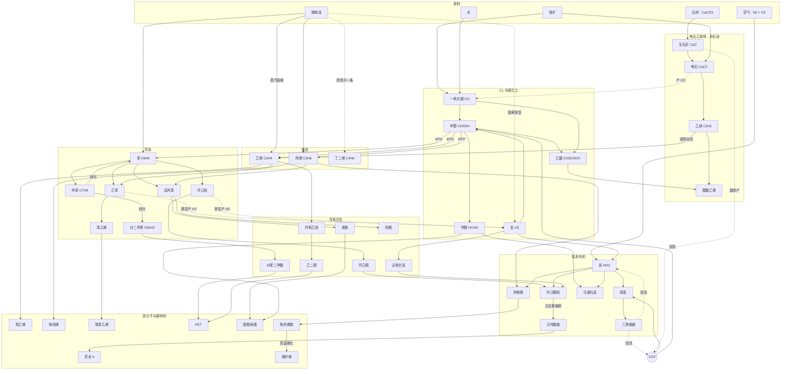

# 有机物调查 V1

> **这是一份调查文档，不是实现清单。** 它回答的是「现实里有哪些有机物、它们什么性质、彼此怎么反应」，
> 以及「其中哪些能进 Project Eden、接在什么位置」。要不要做、做多少，是之后的决定。
>
> 全文遵守 CLAUDE.md 的第一条内容规则：**每个数值都必须能追到现实依据**，
> 推导过程写在这里，将来落进 `ores.json` 时直接搬进 `//` 注释即可。

---

## 〇、现状：mod 里已经有的有机物

| 物品 | 分子式 | 现有下游 |
|---|---|---|
| 一氧化碳 | CO | 甲醇合成、费托合成、还原钴 |
| 甲醇 | CH₃OH | 甲醛、乙烯（MTO）、还原钴 |
| 甲醛 | HCHO | **只有还原钴一条** ← 明显偏薄 |
| 乙烯 | C₂H₄ | 还原钴 / 锰 / 铬 / 铝（四种矿里唯一的万能还原剂） |
| **丙烯** *(1.5.0 新增，6643)* | C₃H₆ | 铝块 · 丙烯烃热还原 |

外加参与有机反应的无机气体：CO₂、O₂、N₂、NH₃、NO₂、HNO₃。

> **丙烯已经落地了**，随催化反应器一起进的 1.5.0：由 `丙烯 · 催化裂化`
> （蜡油 ×12 → 丙烯 ×2 + 乙烯 ×3）和 `乙烯 · 甲醇制烯烃（流化床）`
> （甲醇 ×7 → 乙烯 ×2 + 丙烯 ×1 + 水 ×7）两条产出，热值 **14.1 MJ**
> ——正是本文第 2.1 节按煤锚点算出来的那个数，两边用的是同一把尺子。
> 这直接改变了第七节的分期账：**「拿到丙烯」这一步已经不用再花钱了。**

**两个结构性问题，这份调查就是冲着它们去的：**

1. **甲醛是死胡同。** 它现在只是个「中等还原剂」，而现实里甲醛是酚醛树脂、聚甲醛、乌洛托品的起点。
2. **真正的死端是硝酸，不是氨。** 写稿时这里写的是「氨和硝酸都没有有机下游」，查过仓库之后要改口：
   **氨有两个下游**（钴块 · 氨还原、二氧化氮 · 氨催化氧化），而 **硝酸产出来之后全仓库零消费者** ——
   它才是那个纯粹的终点。

   这一改会往后传：硝酸的现实出路是**硝化**（硝基苯 → 苯胺），而硝化必须先有芳烃。
   所以**给硝酸找下游是第三期的事，第一期做不到**。第一期的理由只剩「甲醛脱离死胡同」一条
   ——那一条是真的。

---

## 一、判据：新物质的数值怎么定

沿用 CLAUDE.md 已确立的四条，外加这次新增的两条边界。

| 属性 | 判据 | 本文的执行 |
|---|---|---|
| `isFluid` | 常温常压下的相态 | 见第二节「常温相态」列，**苯酚、尿素、对苯二甲酸等是固体**，别想当然当液体 |
| `fuelType` | 它现实中是不是真的当燃料烧 | 烃类和简单醇给热值；**酸、酯、单体、聚合物不给** |
| `heatValue` | 燃烧焓换算，锚点唯一 | `MJ = ΔcH(kJ/mol) × 0.006861`，锚点为原版煤 2.7 MJ ↔ 393.5 kJ/mol |
| 机器归类 | **反应类别**，不是方便 | 氧化还原 → 类型 10；脱水/缩合/重排 → 原版化工厂类型 2；固相高温 → 冶炼炉类型 1；电解 → 类型 9 |

### 这次新增的两条边界

**边界一：没有氯，整条氯碱系不做。** DSP 没有氯源（CLAUDE.md 在锂的电解质那里已经记过一次）。
这一刀砍掉的是：PVC、氯乙烯、环氧氯丙烷、光气、**以及有机硅**（直接法要 CH₃Cl）。
不要为了这些去硬造一个「氯矿」——那违反第一条内容规则。

**边界二：没有农业，发酵路线不做。** 乙醇、乳酸、PLA、柠檬酸这一支现实中靠生物质，
DSP 没有可再生碳源。**但乙醇可以走乙烯水合**（石油路线），所以乙醇本身没被砍掉，只是来路不同。

---

## 二、有机物物理性质总表

**已有 5 种（丙烯随 1.5.0 落地）+ 建议新增 23 种。** 熔沸点为常压值；ΔcH 为标准燃烧焓（液态水基准）。

### 2.1 烃类（烯烃 / 炔烃 / 芳烃）

| 物质 | 分子式 | 分子量 | 熔点 ℃ | 沸点 ℃ | 常温相态 | ΔcH kJ/mol | 折算热值 |
|---|---|---|---|---|---|---|---|
| 乙烯 *(已有)* | C₂H₄ | 28.05 | −169.2 | −103.7 | 气 | 1411 | 9.7 MJ |
| 丙烯 *(已有，1.5.0)* | C₃H₆ | 42.08 | −185.2 | −47.6 | 气 | 2058 | 14.1 MJ |
| **1,3-丁二烯** | C₄H₆ | 54.09 | −108.9 | −4.4 | 气 | 2541 | **17.4 MJ** |
| **乙炔** | C₂H₂ | 26.04 | −80.8 | −84 *(升华)* | 气 | 1301 | **8.9 MJ** |
| **苯** | C₆H₆ | 78.11 | 5.5 | 80.1 | 液 | 3268 | **22.4 MJ** |
| **甲苯** | C₇H₈ | 92.14 | −95.0 | 110.6 | 液 | 3910 | **26.8 MJ** |
| **对二甲苯** | C₈H₁₀ | 106.17 | 13.3 | 138.4 | 液 | 4553 | **31.2 MJ** |
| **乙苯** | C₈H₁₀ | 106.17 | −95.0 | 136.2 | 液 | 4565 | **31.3 MJ** |
| **苯乙烯** | C₈H₈ | 104.15 | −30.6 | 145.2 | 液 | 4395 | **30.2 MJ** |
| **异丙苯** | C₉H₁₂ | 120.19 | −96.0 | 152.4 | 液 | 5215 | **35.8 MJ** |
| **环己烷** | C₆H₁₂ | 84.16 | 6.5 | 80.7 | 液 | 3920 | **26.9 MJ** |

> **苯的熔点 5.5 ℃ 值得单独说一句**：它在冷天会凝固，是化工厂里真实存在的麻烦。
> 游戏里仍按液体处理（`isFluid: true`），但这是个可以写进 `description` 的真实细节。

### 2.2 含氧有机物

| 物质 | 分子式 | 分子量 | 熔点 ℃ | 沸点 ℃ | 常温相态 | ΔcH kJ/mol | 折算热值 |
|---|---|---|---|---|---|---|---|
| 一氧化碳 *(已有)* | CO | 28.01 | −205.0 | −191.5 | 气 | 283 | 1.95 MJ |
| 甲醇 *(已有)* | CH₃OH | 32.04 | −97.6 | 64.7 | 液 | 726 | 5.0 MJ |
| 甲醛 *(已有)* | HCHO | 30.03 | −92.0 | −19.3 | 气 | 571 | *不给（非燃料）* |
| **乙醛** | C₂H₄O | 44.05 | −123.4 | 20.2 | 气/液边缘 | 1167 | **8.0 MJ** |
| **乙酸** | CH₃COOH | 60.05 | 16.6 | 118.1 | 液 | 874 | *不给（非燃料）* |
| **环氧乙烷** | C₂H₄O | 44.05 | −111.7 | 10.4 | 气 | 1306 | **9.0 MJ** |
| **乙二醇** | C₂H₆O₂ | 62.07 | −12.9 | 197.3 | 液 | 1180 | *不给* |
| **乙醇** | C₂H₅OH | 46.07 | −114.1 | 78.4 | 液 | 1367 | **9.4 MJ** |
| **丙酮** | C₃H₆O | 58.08 | −94.7 | 56.1 | 液 | 1790 | **12.3 MJ** |
| **苯酚** | C₆H₅OH | 94.11 | **40.9** | 181.7 | **固** | 3054 | *不给* |
| **环己酮** | C₆H₁₀O | 98.14 | −47.0 | 155.6 | 液 | 3519 | *不给* |
| **对苯二甲酸** | C₈H₆O₄ | 166.13 | 402 *(升华)* | — | **固** | 3223 | *不给* |
| **过氧化氢** | H₂O₂ | 34.01 | −0.43 | 150.2 | 液 | — *(不燃)* | *不给（是氧化剂）* |

> **苯酚常温是固体（熔点 40.9 ℃）**，这和直觉相反 —— 它在实验室里是块状的。
> 同理**对苯二甲酸不熔化、直接升华**，所以 PET 缩聚在现实中要先做成酯或用浆料工艺。
> **过氧化氢按 CO₂/O₂ 同一条判据处理：它是氧化剂，不给热值。**

### 2.3 含氮有机物

| 物质 | 分子式 | 分子量 | 熔点 ℃ | 沸点 ℃ | 常温相态 | ΔcH kJ/mol | 折算热值 |
|---|---|---|---|---|---|---|---|
| **尿素** | CO(NH₂)₂ | 60.06 | 132.7 *(分解)* | — | **固** | 632 | *不给（是肥料/原料）* |
| **三聚氰胺** | C₃H₆N₆ | 126.12 | 345 *(分解)* | — | **固** | — | *不给* |
| **丙烯腈** | C₃H₃N | 53.06 | −83.5 | 77.3 | 液 | 1761 | *不给（剧毒单体）* |
| **乌洛托品** | C₆H₁₂N₄ | 140.19 | 280 *(升华)* | — | **固** | 4200 | **28.8 MJ** |
| **环己酮肟** | C₆H₁₁NO | 113.16 | 89.5 | 206 *(分解)* | **固** | — | *不给* |
| **己内酰胺** | C₆H₁₁NO | 113.16 | 69.2 | 270 | **固** | — | *不给* |

> **乌洛托品是这张表里唯一建议给热值的含氮有机物**，理由很实在：
> 它就是野营用的「固体酒精」燃料块（六亚甲基四胺片），是真的拿来烧的。

### 2.4 聚合物与碳材料

聚合物没有熔点只有软化/分解区间，燃烧焓按单体折算意义不大，**一律不给热值**。

| 物质 | 重复单元 | 特征温度 | 现实用途 |
|---|---|---|---|
| **聚乙烯 PE** | [C₂H₄]ₙ | 软化 ~110 ℃ | 最大宗塑料 |
| **聚丙烯 PP** | [C₃H₆]ₙ | 软化 ~160 ℃ | 纤维、容器 |
| **聚苯乙烯 PS** | [C₈H₈]ₙ | 玻璃化 100 ℃ | 泡沫、绝缘 |
| **PET** | [C₁₀H₈O₄]ₙ | 熔点 260 ℃ | 纤维、瓶 |
| **尼龙 6** | [C₆H₁₁NO]ₙ | 熔点 220 ℃ | 工程纤维 |
| **酚醛树脂** | 交联网络 | 不熔（热固） | 最早的合成塑料 |
| **聚丙烯腈 PAN** | [C₃H₃N]ₙ | 分解 300 ℃ | **碳纤维前驱体** |
| **碳纤维** | ~纯 C | 惰性 | 高比强度结构材料 |

---

## 三、有机物化学性质（按官能团分族）

这一节回答的是「**它为什么能参加那个反应**」——落配方时，机器归类和配比都从这里推。

### 3.1 烯烃：π 键是一切的入口

碳碳双键的 π 电子暴露在外，亲电试剂一来就开。所以烯烃能**加成**（加氢、加水、加卤）、
**氧化**（环氧化、羰基化）、**聚合**（π 键打开首尾相接）。

- **乙烯**：最小的烯烃，反应性强而选择性差。工业上靠它做环氧乙烷、乙苯、PE。
- **丙烯**：多一个甲基，**α-氢**被双键活化 —— 这是丙烯能做**氨氧化**（→丙烯腈）而乙烯不能的根本原因。
- **丁二烯**：两个双键共轭，能做 1,4-加成和二烯合成，是橡胶的骨架。

> **还原能力的排序不是拍的，是电子数**：一个 C₂H₄ 完全氧化要让出 12 个电子，
> CO 只有 2 个 —— mod 里那条「一份乙烯还六份钴矿」的配比就是这么来的。

### 3.2 炔烃：更活泼，也更危险

三键的 C≡C 键能高但张力大，乙炔的**生成焓是正的**（+227 kJ/mol），
意味着它自己就是个储能分子 —— 这也是乙炔能纯分解爆炸、必须溶在丙酮里储运的原因。

- 加氢半还原 → 乙烯（选择性加氢，现实中用 Lindlar 催化剂）
- 加乙酸 → 醋酸乙烯（VAM），**是非石油路线做聚合物的关键一步**

### 3.3 芳烃：稳定，要用取代而不是加成

苯环的离域 π 体系带来 **150 kJ/mol 的共振稳定化能**，所以苯**不做加成做取代**。
这条性质决定了芳烃化学的全部形态：

- **烷基化**（Friedel–Crafts）：苯 + 烯烃 → 烷基苯（乙苯、异丙苯）
- **氧化**：侧链被氧化而**苯环不动** —— 对二甲苯的两个甲基被氧化成两个羧基，环完好，这才有了对苯二甲酸
- **加氢**：要强条件才能破环 → 环己烷（这是尼龙线的起点）
- **歧化**：甲苯可以自己重排成苯 + 二甲苯，用来调节产物比例

### 3.4 醇 / 醛 / 酮 / 酸：一条氧化阶梯

```
甲烷 → 甲醇 → 甲醛 → 甲酸 → CO₂        （碳的氧化态 −4 → −2 → 0 → +2 → +4）
乙烯 → 乙醇 → 乙醛 → 乙酸
```

**这条阶梯就是配方梯度的物理依据**：越靠左还原能力越强、越靠右越接近终点。
mod 已有的「甲醇还原三份矿、甲醛还原两份」正是阶梯上差一级的体现。

- **醇**：能脱水成烯（MTO 走的就是这条）、能羰基化成酸（甲醇 + CO → 乙酸）
- **醛**：既能被氧化也能被还原，**且能和氨缩合**（→ 乌洛托品）、和酚缩合（→ 酚醛树脂）
- **酮**：羰基不能再被氧化（没有 α-H 可脱），所以丙酮、环己酮是稳定的终点或转向点
- **羧酸**：能和醇缩合成酯（PET）、和胺缩合成酰胺（尼龙）

### 3.5 含氮有机：氨的三个氢都是接口

NH₃ 的孤对电子和三个 N—H 决定了它能：

- **加到羰基上**再脱水 → 肟、亚胺（环己酮肟、乌洛托品）
- **和烯烃共氧化** → 腈（丙烯腈，SOHIO 法）
- **和 CO₂ 结合** → 氨基甲酸铵 → 尿素（**这是把 CO₂ 固定下来的工业主力反应**）
- **自身脱氢** → 还原性气氛（mod 已有的氨还原钴）

### 3.6 聚合的两种机理，决定了配方长什么样

| | 加成聚合 | 缩合聚合 |
|---|---|---|
| 机理 | π 键打开首尾相连 | 官能团两两反应 |
| 副产物 | **无** | **有**（通常是水） |
| 例子 | PE、PP、PS、PAN | PET、尼龙 6、酚醛树脂 |
| 配方形态 | 单体 → 聚合物，一进一出 | 两种单体 + 出水 |

**这个区别直接决定游戏里的配方形状**，所以值得单列。

---

## 四、化学反应方程式全集

**标注约定**：✅ = 严格配平；⚠️ = 现实工艺真实但化学计量不固定（须在 `//` 里写明，照 `钒块·残渣提取` 的先例）。

### A 组：裂解与芳烃（石油路线）

| # | 名称 | 方程式 | 机器 |
|---|---|---|---|
| A1 | ✅ 蒸汽裂解 | C₄H₈ ×6 → C₂H₄ ×6 + C₃H₆ ×2 + C₆H₆ ×1 + H₂ ×3 | 类型 10 |
| A2 | ✅ 环己烷脱氢 | C₆H₁₂ → C₆H₆ + 3 H₂ | 类型 10 |
| A3 | ✅ 苯加氢 | C₆H₆ + 3 H₂ → C₆H₁₂ | 类型 10 |
| A4 | ✅ 甲苯歧化 | 2 C₇H₈ → C₆H₆ + C₈H₁₀ | 类型 2 |
| A5 | ✅ 乙苯合成 | C₆H₆ + C₂H₄ → C₈H₁₀ | 类型 2 |
| A6 | ✅ 乙苯脱氢 | C₈H₁₀ → C₈H₈ + H₂ | 类型 10 |
| A7 | ✅ 异丙苯合成 | C₆H₆ + C₃H₆ → C₉H₁₂ | 类型 2 |

> **A1 原本被标成「全表唯一不配平的一条」，那是多虑了 —— 它能配平。**
> 本 mod 已经把**精炼油定义成 (CH₂)ₙ**（费托合成 6545 造出来的就是它，一份 = C₄H₈），
> 而 `丙烯 · 催化裂化`（6650）的注释里已经用这个约定算过一次：
> 6 份 × 4 = 24 个 CH₂ = 4 丙烯 + 6 乙烯，**纯裂解碳氢严格守恒，不需要任何配重项**。
>
> 同一把尺子量蒸汽裂解，唯一的差别是苯的 H/C 比低于 CH₂，差额以 H₂ 放出
> （现实裂解气本来就富氢，这不是凑数）：
>
> ```
> C 守恒：6 × 4 = 24 = 6×2 + 2×3 + 1×6
> H 守恒：6 × 8 = 48 = 6×4 + 2×6 + 1×6 + 3×2
> ```
>
> 质量分数 乙烯 50% / 丙烯 25% / 苯 23% / 氢 1.8%。比现实（乙烯 ~35%、丙烯 ~15%、苯 ~10%）
> 都偏高，**因为我们不建模甲烷和裂解燃料油那 15%**，剩下的组分按比例被放大了 —— 这是诚实的省略，
> 写进 `//` 即可，而不是拿它当「计量不固定」的理由。乙烯/丙烯质量比 2.0，现实 2.3，同一量级。
>
> **能配平就别用 ⚠️ 那张豁免牌。** 全仓库只用过一次（`钒块 · 残渣提取`，V 在渣里是痕量、真的没有计量式），
> 用一次贬值一次。
>
> 另外注意它和已有那条 6650 是**同一个形状**：同样 6 份精炼油进，6650 全裂成烯烃，A1 拿走一部分碳去成环。
> 所以 A1 落地时**不是新机制，是给一条已有配方加一个出芳烃的变体**，成本比看上去低。
>
> **丁二烯被从方程里拿掉了**：加上它就是五产物配方，而本 mod 目前最多做到四产物
> （`铬块 · 烃热还原`），`MultiProductUIPatches` 的布局律虽然是线性的、理论上支持 N，
> 但五产物从没在游戏里跑过。要丁二烯就单开一条，别塞进这条。

### B 组：C1 与煤化工（★ = mod 已有）

| # | 名称 | 方程式 | 机器 |
|---|---|---|---|
| B1 ★ | ✅ 水煤气 | C + H₂O → CO + H₂ | 类型 10 |
| B2 ★ | ✅ 合成气制醇 | CO + 2 H₂ → CH₃OH | 类型 10 |
| B3 ★ | ✅ CO₂ 加氢制醇 | CO₂ + 3 H₂ → CH₃OH + H₂O | 类型 10 |
| B4 ★ | ✅ 甲醇氧化 | 2 CH₃OH + O₂ → 2 HCHO + 2 H₂O | 类型 10 |
| B5 ★ | ✅ MTO 甲醇制烯烃 | 2 CH₃OH → C₂H₄ + 2 H₂O | 类型 2 |
| B6 ★ | ✅ 费托合成 | 4 CO + 8 H₂ → (CH₂)₄ + 4 H₂O | 类型 10 |
| B7 | ✅ **甲醇羰基化制乙酸** | CH₃OH + CO → CH₃COOH | 类型 2 |
| B8 | ✅ **MTA 甲醇制芳烃** | 6 CH₃OH → C₆H₆ + 6 H₂O + 3 H₂ | 类型 2 |
| B9 | ✅ **MTP 甲醇制丙烯** | 3 CH₃OH → C₃H₆ + 3 H₂O | 类型 2 |

> **B7 是这次调查里最划算的一条新配方**：它只用 mod 已有的甲醇和 CO，
> 不需要任何新前置就凭空开出一整条含氧衍生物支线。现实中这是 Monsanto / Cativa 法，
> 全球乙酸产量的绝大部分走这条路。
>
> **B8/B9 的意义是「不靠石油也能拿到芳烃和丙烯」** —— 对没有原油的开局是一条完整的替代主干。
>
> **B9 的目的已经被 1.5.0 部分达成了**：催化反应器那条 `乙烯 · 甲醇制烯烃（流化床）`
> 是乙烯丙烯联产（7 甲醇 → 2 乙烯 + 1 丙烯 + 7 水），走的是真实的 DMTO / UOP-MTO
> 而不是纯 MTP。所以「从甲醇拿到丙烯」这条路**已经通了**，B9 若还要做，卖点只能是
> 「专产丙烯、不出乙烯」的选择性，而不是「让丙烯成为可能」。

### C 组：电石乙炔（非石油、非天然气路线）

这是**煤 + 石灰 + 电**的路线，中国的乙炔化工主干，和石油路线完全独立。

| # | 名称 | 方程式 | 机器 |
|---|---|---|---|
| C1 | ✅ 石灰石煅烧 | CaCO₃ → CaO + CO₂ | 类型 1 |
| C2 | ✅ 电石合成 | CaO + 3 C → CaC₂ + CO | 类型 1 |
| C3 | ✅ 电石水解 | CaC₂ + 2 H₂O → C₂H₂ + Ca(OH)₂ | 类型 2 |
| C4 | ✅ 乙炔选择性加氢 | C₂H₂ + H₂ → C₂H₄ | 类型 10 |
| C5 | ✅ 醋酸乙烯合成 | C₂H₂ + CH₃COOH → C₄H₆O₂ | 类型 2 |

> **C2 顺带产 CO，正好接进 B 组的 C1 化工链** —— 和铬铁法产 CO 是同一种设计快感。
> **C1 需要一个钙源，而这里应该走石膏而不是石材。**
> 「石材当石灰石」的近似**比锂那次大得多**：LiOH 代替 LiCl 换的只是电解质阴离子，
> 而 DSP 的石材来自石矿、成分根本不定，把它当纯 CaCO₃ 是在给一个未定义的东西指定分子式。
>
> 仓库里已经有更干净的先例：**熔岩冷却厂的钴配方就是从石膏取钙的**
> —— `CaSO₄ + 4 C → CaS + 4 CO`，挪威 Noril'sk 的硫正是这么从同化的硬石膏里来的。
> 石膏矿是本 mod 自己的矿（17 号矿脉），成分是明确的 CaSO₄，
> 拿它当钙源既不用编近似，也顺手复用了一条已经论证过的反应。
> 代价是会牵出硫，但那条线的入口（硫酸）本 mod 早就有了。

### D 组：含氧衍生与聚酯

| # | 名称 | 方程式 | 机器 |
|---|---|---|---|
| D1 | ✅ 乙烯环氧化 | 2 C₂H₄ + O₂ → 2 C₂H₄O | 类型 10 |
| D2 | ✅ 环氧乙烷水合 | C₂H₄O + H₂O → C₂H₆O₂ | 类型 2 |
| D3 | ✅ 乙烯水合制乙醇 | C₂H₄ + H₂O → C₂H₅OH | 类型 2 |
| D4 | ✅ 乙醇氧化制乙醛 | 2 C₂H₅OH + O₂ → 2 C₂H₄O + 2 H₂O | 类型 10 |
| D5 | ✅ 对二甲苯氧化 | C₈H₁₀ + 3 O₂ → C₈H₆O₄ + 2 H₂O | 类型 10 |
| D6 | ✅ 异丙苯氧化裂解 | C₉H₁₂ + O₂ → C₆H₅OH + C₃H₆O | 类型 10 |
| D7 | ✅ 环己烷氧化 | C₆H₁₂ + O₂ → C₆H₁₀O + H₂O | 类型 10 |
| D8 | ✅ 直接法制双氧水 | H₂ + O₂ → H₂O₂ | 类型 9 |
| D9 | ✅ PET 缩聚 | n C₈H₆O₄ + n C₂H₆O₂ → [C₁₀H₈O₄]ₙ + 2n H₂O | 类型 2 |

> **D6 是化工里著名的「一石二鸟」**：一步同时拿到苯酚和丙酮，两个都是大宗产品。
> 全球苯酚几乎全靠这条路。游戏里这种**单进双出**的配方非常好看，也天然制造「副产物过剩」的取舍。

### E 组：含氮有机 —— 把氨链接进来

**这是本次调查的重点。** mod 已有的氨和硝酸目前没有有机下游，而现实中氨正是这一大类的氮源。

| # | 名称 | 方程式 | 机器 |
|---|---|---|---|
| E1 | ✅ **尿素合成（Bosch–Meiser）** | 2 NH₃ + CO₂ → CO(NH₂)₂ + H₂O | 类型 2 |
| E2 | ✅ **尿素制三聚氰胺** | 6 CO(NH₂)₂ → C₃H₆N₆ + 6 NH₃ + 3 CO₂ | 类型 2 |
| E3 | ✅ **丙烯氨氧化（SOHIO）** | 2 C₃H₆ + 2 NH₃ + 3 O₂ → 2 C₃H₃N + 6 H₂O | 类型 10 |
| E4 | ✅ **乌洛托品合成** | 6 HCHO + 4 NH₃ → C₆H₁₂N₄ + 6 H₂O | 类型 2 |
| E5 | ✅ **环己酮氨肟化** | C₆H₁₀O + NH₃ + H₂O₂ → C₆H₁₁NO + 2 H₂O | 类型 2 |
| E6 | ✅ **贝克曼重排** | C₆H₁₁NO *(肟)* → C₆H₁₁NO *(己内酰胺)* | 类型 2 |

> **E1 把 CO₂ 第二次固定下来。** mod 现在只有「CO₂ 加氢制醇」一条回收路，
> 尿素这条在现实中体量大得多 —— 它是全球合成氨最大的下游。
>
> **E2 的妙处是它把 NH₃ 和 CO₂ 又吐回去**：6 份尿素只留下 1 份三聚氰胺，
> 其余全部回流。这在游戏里是一条天然的「浓缩」配方 —— 看着亏，其实是把氮聚起来。
>
> **E6 是全表唯一的异构化**：反应物和产物**分子式完全相同**（C₆H₁₁NO），只是骨架重排。
> 现实中用发烟硫酸做介质 —— 而 **mod 已经有硫酸**，正好接上。
> 这种「进出同式」的配方在游戏里极少见，本身就是个亮点。

### F 组：聚合物与碳材料

| # | 名称 | 方程式 | 机器 |
|---|---|---|---|
| F1 | ✅ 聚乙烯 | n C₂H₄ → [C₂H₄]ₙ | 类型 2 |
| F2 | ✅ 聚丙烯 | n C₃H₆ → [C₃H₆]ₙ | 类型 2 |
| F3 | ✅ 聚苯乙烯 | n C₈H₈ → [C₈H₈]ₙ | 类型 2 |
| F4 | ✅ 聚丙烯腈 | n C₃H₃N → [C₃H₃N]ₙ | 类型 2 |
| F5 | ✅ 尼龙 6 开环聚合 | n C₆H₁₁NO → [C₆H₁₁NO]ₙ | 类型 2 |
| F6 | ⚠️ 酚醛树脂缩聚 | 苯酚 + 甲醛 → 树脂 + H₂O（交联网络，无固定计量） | 类型 2 |
| F7 | ⚠️ **PAN 碳化制碳纤维** | [C₃H₃N]ₙ → 碳纤维 + N₂ + H₂（200→1500 ℃ 多段热解） | 类型 1 |

> **F7 是整棵树的顶点，也是最值得做的一条**：它把**氮链**（氨）、**烯烃链**（丙烯）、
> **高温冶炼**三者汇到一起，产出一种 DSP 里没有、但明显属于「后期结构材料」的东西。
> 现实中碳纤维正是这么来的 —— 全球绝大部分碳纤维的前驱体就是 PAN。
> 碳化过程会脱掉氮和氢、只留碳骨架，所以**质量收率只有约 50%**，这个损耗是真实的、可以直接做成配方数值。
>
> **但做之前必须先答一个问题：它凭什么不是碳纳米管的劣化版。**
> DSP 原版已经有**碳纳米管**，同样是「后期纯碳结构材料」，而本 mod 还把刺笋结晶的
> 采矿产物直接 remap 成了它（`advancedminer.json` 的 `productMap`）。两个同位物品并存，
> 就正面撞上仓库自己那条支配性判据：**四轴上不更强、成本又不更低 = 死内容**。
>
> 现实里的区分是各向异性和成本（碳纤维便宜、按丝束论吨；碳纳米管贵、按克论），
> 但**那个区分必须在游戏里表达得出来**才算数 —— 比如碳纤维走大宗建材、碳纳米管留给电子，
> 或者给碳纤维一个明显更低的成本和明显更低的某一轴。
> 想不出来就别做：F7 的机制再好看，产出一个没人要的物品仍然是死内容。

### G 组：闭环回路（这才是「产物循环」的实质）

| 回路 | 路径 | 意义 |
|---|---|---|
| **碳回路 I** | 碳热还原排 CO₂ → B3 制甲醇 | 已有 |
| **碳回路 II** | CO₂ + 氨 → 尿素 → 三聚氰胺 → 吐回 CO₂ + NH₃ | 新增，且是双回路 |
| **CO 回路** | 铬铁法 / 电石 / 乙烯还铝 产 CO → B2/B7 吃掉 | 三个来源汇一处 |
| **氢回路** | A2/A6 脱氢产 H₂ → B2/B3/C4/D8 吃掉 | 芳烃线自己供氢 |
| **水回路** | 几乎所有缩合反应产水 → B1 水煤气吃掉 | 全局 |
| **乙酸回路** | B7 产乙酸 → C5 做 VAM | 把 C1 和乙炔线缝起来 |

---

## 五、产物循环流程图



**图里三条闭环值得单独看：**

1. **CO₂ 有两个吃口**（甲醇、尿素）和三个来源（煅烧、碳热还原、三聚氰胺回流）——不再是单向排放。
2. **氢自给**：芳烃线的两处脱氢（乙苯→苯乙烯、环己烷→苯）产氢，正好喂甲醇合成和氨合成。
3. **三条路都能到乙烯**：石油裂解、甲醇 MTO、电石乙炔加氢 —— 开局缺什么就走哪条。

---

## 六、与游戏的接口

| 现实产物 | 接进 DSP 的方式 |
|---|---|
| 聚乙烯 / 聚丙烯 | **直接映射到原版「塑料」**（就像碳钢映射到原版钢材），不新增物品 |
| PET / 尼龙 6 / 聚苯乙烯 | 新物品，或折算成原版塑料的高效配方 |
| 酚醛树脂 | 新物品，早期热固性材料，可做建筑材料 |
| 碳纤维 | **新物品，后期结构材料** —— 这是整棵树的顶点 |
| 乌洛托品 | 可作机甲燃料（现实中的固体燃料块），热值 28.8 MJ |
| 尿素 / 三聚氰胺 | 中间体，三聚氰胺可做阻燃/耐热材料 |
| 乙酸 / 乙二醇 / 苯酚 | 纯中间体，不直接消费 |

### 物品格位是硬约束，而且它应该排在化学之前

这不是脚注，是**分期唯一真正的预算线**。CLAUDE.md 记着：

- 物品栏第 1 页已 **111/112** 占满，新物品一律溢出到**第 14 列以后**；
- `UIItemPicker` 有搜索框和横向翻页，所以分拣器过滤、物流站格子、储物箱过滤都还能选到；
- 但 **`UILootFilter`、`UISignalPicker`、`UISignalTagPicker` 根本画不出第 14 列以后的东西** ——
  它们各自重写了 `RefreshIcons`，都没有翻页也没有搜索。

所以问题不是「这 24 种做不做得完」，而是**每加一个物品都在加深一个已知缺陷**。
第五期真正该排的不是某条化学主线，而是**把搜索行移植到那三个窗口**
（`ItemPickerSearchPatches` 的填充逻辑与 `GridIndex` 无关，是这三个里最便宜的一半）。

下一节的分期因此按**净新增物品数**排，而不是按化学漂亮程度排。

---

## 七、分期建议

**这一节是我的推荐，不是结论。** 按**净新增物品数**排 —— 理由见上一节。

| 期 | 净新增物品 | 换到什么 | 判断 |
|---|---|---|---|
| 一期 | **2**（尿素、乌洛托品） | 甲醛 1→3 条下游、CO₂ 1→2 个吃口、一种固体燃料 | **已落地** |
| ~~乙酸~~ | — | 零前置范围内的唯一去处被精确支配 | **推迟**，见下 |
| ~~三聚氰胺~~ | — | 它自己没有下游 | **不做** |
| 二期 | **＋2**（丙烯腈、PAN） | 碳纳米管的第三条路 ＋ 氮的全额闭环 | **已落地** |
| 三期 | **＋4**（苯、异丙苯、苯酚、丙酮） | 异丙苯法 ＋ 第二条不吃油的塑料路线 | **已落地** |
| 四期 | ＋4 | 无油开局替代主干 | 可选 |

### 第一期：零新增前置，纯粹补全已有物质的下游（净 +2 物品）—— **已落地**

**做了什么**（物品 6644 / 6645，配方 6654 / 6655 / 6656，全部归原版化工厂类型 2）：

| 配方 | 内容 | 买到了什么 |
|---|---|---|
| E1 **尿素 · 二氧化碳氨合成** | 氨 ×2 + CO₂ ×1 → 尿素 ×1 + 水 ×1 | CO₂ 的第二个吃口 |
| E4 **乌洛托品 · 甲醛氨缩合** | 甲醛 ×6 + 氨 ×4 → 乌洛托品 ×1 + 水 ×6 | 甲醛的第二条下游，且是**燃料 28.8 MJ** |
| F6′ **塑料 · 脲醛树脂** | 尿素 ×2 + 甲醛 ×3 → **原版塑料** ×2 + 水 ×2 | 甲醛的第三条下游 + 尿素的终端 |

前两条严格配平；第三条是交联网络，⚠️ 按真实摩尔比 F/U = 1.5 定比，已在 `//` 里写明。

**结果**：甲醛 1 → 3 条下游，氨 2 → 3 条，CO₂ 1 → 2 个吃口。

#### 落地时改了两处判断

**（1）乙酸被推迟了 —— 它在零前置范围内会是死内容。**
写稿时把 B7 列为「最划算的一条新配方」，理由是不需要任何新前置。这一条仍然成立，
但它漏算了下游：乙酸在零前置范围内唯一能去的地方是当钴的还原剂，而那条被
**「甲醇和一氧化碳分开用」精确支配**：

```
乙酸路线：1 乙酸 → 还原 4 份矿      （乙酸 = 1 甲醇 + 1 一氧化碳）
分开用：  1 甲醇 → 3 份 ＋ 1 一氧化碳 → 1 份 ＝ 4 份
```

碳守恒，所以两边**恰好相等**，而乙酸路线还多花一台机器和一条皮带。
照仓库自己的支配判据（不更强、不更便宜 = 死内容），它现在不能做。
它真正的去处是**醋酸乙烯 → 聚乙烯醇**，或走乙烯气相乙酰氧基化
（`2 C₂H₄ + 2 CH₃COOH + O₂ → 2 VAM + 2 H₂O`，现代路线，不需要乙炔）——
两条都要再加两个物品，所以它属于第二期之后。

> **教训和 A1 那次是同一类，只是方向相反**：A1 是「看着不能配平，其实能」；
> 这次是「看着零成本，其实有下游债」。**一条新配方的成本要算到它产物的终点为止。**

**（2）三聚氰胺同样没做。** 尿素能吃掉它没错，但它自己没有下游 ——
做出来就是第二个硝酸。尿素的终端改由脲醛树脂承担，而树脂**不新开物品、直接落原版塑料**，
理由见下。

#### 一条通则：新物品最贵的不是图标，是下游

本 mod 已经有一个反面例子 —— **硝酸**，氮链造到它就到头，全仓库零消费者。
所以脲醛树脂没有做成新物品，而是直接产**原版塑料**：它现实中本就是一种塑料
（氨基塑料，最早的一批热固性材料），而塑料是原版消耗大户，这条线不会堵。
先例是本文第六节自己写的「聚乙烯 / 聚丙烯 → 原版塑料」。

**这条通则对后面每一期都适用**：算净新增物品数的时候，顺手算一遍「它们各自被谁吃掉」。

### 第二期：烯烃与氮的交汇（净 +2 物品）—— **已落地**

**做了什么**（物品 6646 / 6647，配方 6657 / 6658 / 6659）：

| 配方 | 机器 | 内容 |
|---|---|---|
| E3 **丙烯腈 · 丙烯氨氧化** | 氧化还原化工厂 | 丙烯 ×2 + 氨 ×2 + 氧 ×3 → 丙烯腈 ×2 + 水 ×6 |
| F4 **聚丙烯腈 · 加成聚合** | 化工厂 | 丙烯腈 ×2 → 聚丙烯腈 ×2 |
| F7 **碳纳米管 · 聚丙烯腈碳化** | 冶炼厂 | 聚丙烯腈 ×2 → **原版碳纳米管** ×1 + 氮气 ×1 + 氢 ×3 |

第一、三条按原子严格配平；第二条是加成聚合，无副产物、质量本来守恒，所以两边数目相同。

#### 落地时改了一处判断：碳纤维不做成新物品

写稿时 F7 被标成「整棵树的顶点，最值得做」，前提是先答「它凭什么不是碳纳米管的劣化版」。
**这个问题的答案是：不做那个物品。**

原版碳纳米管已经占住了「后期纯碳结构材料」这个位置，本 mod 还把刺笋结晶的采矿产物 remap 成了它。
再加一个同位物品，要么四轴上分不开（死内容），要么得硬编一套区分（各向异性、成本），
而那套区分**在游戏里表达不出来**。所以碳化那一步直接产原版碳纳米管。

净新增因此从 +3 降到 **+2**，而且拿到的东西比原方案多一件：**一条不依赖刺笋结晶矿脉的碳纳米管路线**
——和费托合成让精炼油不再依赖原油产地是同一种价值。

> **一处近似**：现实里 PAN 碳化得到的是碳纤维 / 碳纳米纤维，和碳纳米管同族不同形（管是气相沉积长的）。
> 落到原版碳纳米管上是「聚乙烯 → 原版塑料」那条映射惯例的延用，已在 `//` 里写明。

#### 一个没预料到的结果：氮是全额循环的

2 份氨要 1 份氮气 + 3 份氢，而碳化那一步正好放出 1 份氮气 + 3 份氢。
**这不是凑的**——氮的任务就是把氰基挂上去、让链受热时环化成梯形，碳化时任务完成就被赶出去。
所以这条线的净消耗只有丙烯和氧，气巨采来的氮气在里面转圈。

调查稿第七节 G 组列了六条闭环，这是第七条，而且是唯一一条**投入品全额返还**的。

### 第三期：芳烃主干（净 +4 物品）—— **已落地，照建议只做了一条**

**做了什么**（物品 6648~6651，配方 6660~6664）：

| 配方 | 机器 | 内容 |
|---|---|---|
| A1 **苯 · 蒸汽裂解** | 氧化还原化工厂 | 精炼油 ×6 → 乙烯 ×6 + 丙烯 ×2 + 苯 ×1 + 氢 ×3 |
| B8 **苯 · 甲醇制芳烃** | **催化反应器** | 甲醇 ×6 → 苯 ×1 + 水 ×6 + 氢 ×3 |
| A7 **异丙苯 · 苯烷基化** | 化工厂 | 苯 ×1 + 丙烯 ×1 → 异丙苯 ×1 |
| D6 **苯酚 · 异丙苯氧化裂解** | 氧化还原化工厂 | 异丙苯 ×2 + 氧 ×2 → 苯酚 ×2 + 丙酮 ×2 |
| F6 **塑料 · 酚醛树脂** | 化工厂 | 苯酚 ×3 + 甲醛 ×4 → **原版塑料** ×4 + 水 ×4 |

前四条严格配平。**四个新物品各自的去处**：苯和异丙苯是燃料兼原料，丙酮是燃料（12.3 MJ），
苯酚走酚醛树脂落到原版塑料——沿用第一期那条通则，不新开「树脂」物品。

#### 落地时确认的三件事

**（1）A1 确实能配平**，第四节那次改口是对的：`6 C₄H₈ → 6 C₂H₄ + 2 C₃H₆ + C₆H₆ + 3 H₂`，
C 24 = 24、H 48 = 48。而且它和已有的「丙烯 · 催化裂化」不互相支配——同样 6 份油，
那条全裂成烯烃，这条拿两份丙烯换一份苯加三份氢。

**（2）B8 落在催化反应器上，不是普通化工厂。** MTA 和 MTO 一样跑 ZSM-5，而芳构化的结焦更凶
（苯环本来就是积碳的前一步），这正对上那座建筑的机制。写稿时只说了它「不靠石油」，
没注意到它在机器归类上也自洽。

**（3）两条通向原版塑料的路不算重复**，因为它们要的基础设施不同：
脲醛吃氨（→ 氮气 → 气态巨星 + 轨道采集器），酚醛吃苯（→ 精炼油或甲醇 → 煤和水）。
每份塑料的树脂投料刻意对齐到 105 g vs 101 g，**效率上谁也不比谁划算**——
这是「三条路都能到乙烯」那种设计，不是后来者更强。

#### 硝酸仍然悬着，而且这次是有意的

本节原本写着「把硝基苯 / 苯胺一起算进预算，别让硝酸继续悬着」。苯已经有了，硝化本可以做，
**但苯胺自己没有下游**——它的去处是 MDI 和聚氨酯，那是又两三个物品，最后还是停在一个没人要的
东西上。加两个物品换一个更深的死端，不划算。

这正是第一期立下的那条通则在起作用：**算净新增物品数的时候，顺手算一遍「它们各自被谁吃掉」。**
硝酸等它的下游想清楚了再一起做。

### 第四期（可选）：电石乙炔线

作为**无油开局的替代主干**存在。它的价值不在产物，而在「不依赖原油也能跑完整条有机链」。
**钙源走石膏，不走石材**（见 C 组注）。

### 第五期：不是化学，是那三个窗口

把 `ItemPickerSearchPatches` 的搜索行移植到 `UILootFilter` / `UISignalPicker` /
`UISignalTagPicker`。**它不产出任何物品，却是上面每一期的前置** —— 越往后做，
积压的「选不到的物品」越多。

---

## 八、明确不做

| 方向 | 不做的原因 |
|---|---|
| 氯碱系（PVC、光气、环氧氯丙烷） | **DSP 没有氯源**，硬造氯矿违反内容规则 |
| 有机硅 | 直接法需要 CH₃Cl，同上 |
| 发酵路线（乳酸、PLA、柠檬酸） | 没有生物质/农业。乙醇保留，但走乙烯水合 |
| 含磷有机 | 没有磷源 |
| 精细化工 / 药物 | 与「后期产线拉满」的 mod 定位不符 |

> **还有一条不是「不做什么」而是「怎么做」的通则，从 A1 那次改口里来：**
> ⚠️（计量不固定）是一张**豁免牌，不是一种标注**。全仓库只用过一次
> （`钒块 · 残渣提取` —— 钒在石油渣里是痕量杂质，真的没有固定计量式）。
> 在给任何方程盖这个章之前，先问一遍「换个已有约定能不能配平」
> —— A1 就是靠「精炼油 = (CH₂)ₙ」这个本 mod 早就定下的约定配平的。

---

---

## 十、和汽油化工的联动（已落地）

三期做完之后问的一个问题：**油这边怎么和有机合成接上。** 查下来缺的不是接口——
精炼油已经有四个来源、五个去处——缺的是**三个真实的炼厂单元**。

### 先发现的是一个断头

`钒渣油` 这个物品自己的 `//` 一直写着：

> 取这个名字是因为钒和硫在原油里本来就富集在这一端——「**钒块 · 残渣提取**」提的就是它。

而那条配方吃的是 **精炼油 ×40 + 硫酸 ×4**，跟渣油毫无关系。**注释描述的联动，数据里不存在。**
于是渣油唯一的用途是当低温燃料，而减压蒸馏那条配方除了产渣油之外没有存在理由。

> **这条教训值得单列**：一条 `//` 声称两个条目之间有关系时，那只是个说法——
> 得去查另一条的 `items`/`results` 才算数。它是靠**把所有和油有关的物品的产/消两侧都列出来**
> 发现的，光读那两处的文字永远看不出来。和「一个零读者的具名常量只是个说法」是同一族。

### 落地的三样

| | 配方 | 内容 |
|---|---|---|
| 一 | 钒块 · 残渣提取（**改**） | 钒渣油 ×12 + 硫酸 ×4 → 钒块 ×1 + CO₂ ×8 |
| 四 | **石脑油 · 常减压蒸馏**（改，切四段） | 原油 ×10 → 石脑油 ×2 + 精炼油 ×3 + 蜡油 ×3 + 钒渣油 ×2 |
| 四 | **石脑油 · 加氢裂化**（新） | 蜡油 ×5 + 氢 ×1 → 石脑油 ×3 + 精炼油 ×2 |
| 二 | **苯 · 催化重整**（新，催化反应器） | 精炼油 ×3 → 苯 ×2 + 氢 ×6 |
| 三 | **硫磺 · 渣油加氢脱硫**（新） | 钒渣油 ×4 + 氢 ×2 → 硫磺 ×1 + 精炼油 ×3 |
| 三 | **硫酸 · 接触法**（新） | 硫磺 ×2 + 氧 ×3 + 水 ×2 → 硫酸 ×2 |

外加四种新有机液体接进可燃液体发电（苯 700 / 异丙苯 800 / 丙烯 950 / 丙酮 1300 ℃），
以及把原先那条 `氢 · 催化重整` 改名为 `氢 · 蒸汽重整`——它做的是 steam reforming，
而「催化重整」在炼厂里专指另一件事。

**净新增一个物品（硫磺），换到三条闭环**：

1. **渣油有了三个去处**（提钒 / 脱硫 / 低温燃料）——同一桶塔底料拿去干什么成了取舍
2. **硫酸有了第二条路**（接触法 vs 石膏法）：一条要原油和氢，一条要石膏矿脉
3. **催化重整的副产氢正好喂加氢脱硫**，和现实中炼厂的氢平衡一致

### 两条按本文判据做的取舍

**苯的温度排在精炼油下面，虽然它的能量密度是五倍。** 那张温度表的轴是「允许多高的热通道温度」，
受灰分/硫/金属/积碳限制；新来的四种全都无灰无硫无金属，所以位次**完全由积碳定**。
而苯是炭黑的骨架——HACA 机理每一轮都在往芳环上加碳，苯是起点不是产物。
这让「能量密的反而烧不了高温」这条机制拿到了它最干净的一个例子。

**没做「脱硫精炼油」。** 物理上脱过硫的油确实该烧得更热，但表达它要新开一个物品，
而那个物品作为燃料**严格支配原版精炼油**，每个吃精炼油的配方还得决定认不认它。
这正是前三期一直在躲的支配/死内容问题，所以脱硫的产物直接落回原版精炼油。

### 第四样：一桶原油切四段

前三样落地之后剩的最后一个问题：**所有这些配方都在吃同一种「精炼油」，
而现实里它们吃的根本不是同一种油。**

```
常减压蒸馏   原油×10 → 石脑油×2 + 精炼油×3 + 蜡油×3 + 钒渣油×2
```

收率锚在中质原油的真实切割比例（22 / 30 / 27 / 21%）。常压塔和减压塔合成一条——
中文炼厂里「常减压」本来就是一套装置。四产物正好是本 mod 已验证的上限。

**下游不用重新设计，因为它本来就存在**——只是四条配方全错配在精炼油上：

| 配方 | 改成吃 | 硬理由 |
|---|---|---|
| 苯 · 蒸汽裂解 | 石脑油 | 乙烯装置的正式名字就叫「石脑油裂解装置」 |
| 苯 · 催化重整 | 石脑油 | 炼厂里这一段就叫「重整石脑油」 |
| 氢 · 蒸汽重整 | 石脑油 | 轻烃才好重整，重组分直接结焦 |
| 丙烯 · 催化裂化 | **蜡油** | FCC 存在的全部理由就是「把重的变轻」 |

外加一条新的 **石脑油 · 加氢裂化**（蜡油×5 + 氢×1 → 石脑油×3 + 精炼油×2），
它和催化重整构成氢的闭环：重整产氢、加氢裂化耗氢，产出的石脑油又回去喂重整。

#### 两处值得单记

**FCC 吃蜡油不吃渣油，这条现实里的界线正好就是催化反应器的机制。** 渣油里的钒和镍会在
分子筛上沉积、**永久**毒死催化剂；蜡油的金属含量低得多。渣油催化裂化（RFCC）确实存在，
代价就是催化剂消耗翻几倍——而「催化剂会死」正是那座建筑在做的事。这不是为了对上机制而选的，
是两边各自按现实定下来之后撞上的。

**「一件油 = 4 个 CH₂」这个记账单位，是明说出来的抽象。** 四个馏分因此在化学计量上可以互换，
已有那三条配平过的方程换了原料之后一个字都不用改。理由是现实炼厂本来就按桶记账，
而真正区分四个馏分的**不是含碳量，是它能喂哪个反应**——这正是这一整节在讲的事。

#### 顺带：四个切段自己把那条机制演完了

| 钒渣油 12.0 MJ / 500 ℃ | 蜡油 8.0 / 600 | 精炼油 4.5 / 750 | 石脑油 3.0 / 900 |
|---|---|---|---|

越往塔底越重、能量越密，硫和金属也越多、越烧不了高温。**两条梯子严格反向，
而它们是同一桶油里分出来的四样东西**——可燃液体发电那套机制的论点，
从此不需要再拿藻油和氨去对比。

### 一个不是编出来的巧合

接触法的催化剂是**五氧化二钒**，而 V₂O₅ 也正是钒渣油烧不了高温的原因（熔点低于热通道温度，
会熔在涡轮叶片上）。**同一种东西在一处是毒、在另一处是催化剂**——这两条都是先分别按现实定下来的，
撞到一起是后来才发现的。


## 九、来源

- [Steam Cracking — Global Energy Monitor](https://www.gem.wiki/Steam_Cracking)
- [Steam Cracking — ScienceDirect Topics](https://www.sciencedirect.com/topics/chemistry/steam-cracking)
- [Sohio Acrylonitrile Process — American Chemical Society](https://www.acs.org/education/whatischemistry/landmarks/acrylonitrile.html)
- [Ammoxidation — ScienceDirect Topics](https://www.sciencedirect.com/topics/chemical-engineering/ammoxidation)
- [Cativa process — Wikipedia](https://en.wikipedia.org/wiki/Cativa_process)
- [Monsanto process — Wikipedia](https://en.wikipedia.org/wiki/Monsanto_process)
- [The Cativa™ Process for the Manufacture of Acetic Acid — Johnson Matthey Technology Review](https://technology.matthey.com/content/journals/10.1595/003214000X44394105)
- [Bosch–Meiser process — Wikipedia](https://en.wikipedia.org/wiki/Bosch%E2%80%93Meiser_process)
- [1922 Bosch-Meiser BASF Urea Process — UreaKnowHow](https://ureaknowhow.com/1922-bosch-meiser-basf-urea-process/)
- [Cumene process — Wikipedia](https://en.wikipedia.org/wiki/Cumene_process)
- [Hock Process — ScienceDirect Topics](https://www.sciencedirect.com/topics/chemistry/hock-process)
- [New synthesis routes for production of ε-caprolactam — RWTH Aachen](http://publications.rwth-aachen.de/record/459429/files/2681.pdf)
- [A Study on Byproducts in the High-Pressure Melamine Production Process — PMC](https://pmc.ncbi.nlm.nih.gov/articles/PMC10488481/)
- [Preparation of Acetylene from Calcium Carbide — Unacademy](https://unacademy.com/content/neet-ug/study-material/chemistry/preparation-of-acetylene-from-calcium-carbide/)
- [Production of calcium carbide — US Patent 4391786](https://image-ppubs.uspto.gov/dirsearch-public/print/downloadPdf/4391786)
- [Bakelite — Britannica](https://www.britannica.com/science/Bakelite)
- [Studies on the formation of hexamine from formaldehyde and ammonium salts](https://cdnsciencepub.com/doi/10.1139/cjr47b-062)
