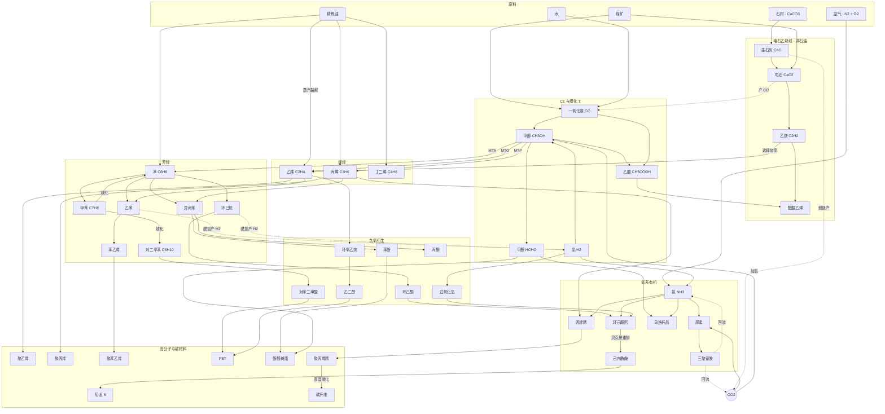

# 有机物调查 V1

> **这是一份调查文档，不是实现清单。** 它回答的是「现实里有哪些有机物、它们什么性质、彼此怎么反应」，
> 以及「其中哪些能进 Project Eden、接在什么位置」。要不要做、做多少，是之后的决定。
>
> 全文遵守 CLAUDE.md 的第一条内容规则：**每个数值都必须能追到现实依据**，
> 推导过程写在这里，将来落进 `ores.json` 时直接搬进 `//` 注释即可。

---

## 〇、现状：mod 里已经有的有机物

| 物品 | 分子式 | 现有下游 |
|---|---|---|
| 一氧化碳 | CO | 甲醇合成、费托合成、还原钴 |
| 甲醇 | CH₃OH | 甲醛、乙烯（MTO）、还原钴 |
| 甲醛 | HCHO | **只有还原钴一条** ← 明显偏薄 |
| 乙烯 | C₂H₄ | 还原钴 / 锰 / 铬 / 铝（四种矿里唯一的万能还原剂） |

外加参与有机反应的无机气体：CO₂、O₂、N₂、NH₃、NO₂、HNO₃。

**两个结构性问题，这份调查就是冲着它们去的：**

1. **甲醛是死胡同。** 它现在只是个「中等还原剂」，而现实里甲醛是酚醛树脂、聚甲醛、乌洛托品的起点。
2. **氨和硝酸没有有机下游。** 氮链造出来之后只能自己玩，而现实中氨正是丙烯腈、己内酰胺、尿素、三聚氰胺的氮源 ——
   **把氮链接进有机链，是这次调查里性价比最高的一处。**

---

## 一、判据：新物质的数值怎么定

沿用 CLAUDE.md 已确立的四条，外加这次新增的两条边界。

| 属性 | 判据 | 本文的执行 |
|---|---|---|
| `isFluid` | 常温常压下的相态 | 见第二节「常温相态」列，**苯酚、尿素、对苯二甲酸等是固体**，别想当然当液体 |
| `fuelType` | 它现实中是不是真的当燃料烧 | 烃类和简单醇给热值；**酸、酯、单体、聚合物不给** |
| `heatValue` | 燃烧焓换算，锚点唯一 | `MJ = ΔcH(kJ/mol) × 0.006861`，锚点为原版煤 2.7 MJ ↔ 393.5 kJ/mol |
| 机器归类 | **反应类别**，不是方便 | 氧化还原 → 类型 10；脱水/缩合/重排 → 原版化工厂类型 2；固相高温 → 冶炼炉类型 1；电解 → 类型 9 |

### 这次新增的两条边界

**边界一：没有氯，整条氯碱系不做。** DSP 没有氯源（CLAUDE.md 在锂的电解质那里已经记过一次）。
这一刀砍掉的是：PVC、氯乙烯、环氧氯丙烷、光气、**以及有机硅**（直接法要 CH₃Cl）。
不要为了这些去硬造一个「氯矿」——那违反第一条内容规则。

**边界二：没有农业，发酵路线不做。** 乙醇、乳酸、PLA、柠檬酸这一支现实中靠生物质，
DSP 没有可再生碳源。**但乙醇可以走乙烯水合**（石油路线），所以乙醇本身没被砍掉，只是来路不同。

---

## 二、有机物物理性质总表

**已有 4 种 + 建议新增 24 种。** 熔沸点为常压值；ΔcH 为标准燃烧焓（液态水基准）。

### 2.1 烃类（烯烃 / 炔烃 / 芳烃）

| 物质 | 分子式 | 分子量 | 熔点 ℃ | 沸点 ℃ | 常温相态 | ΔcH kJ/mol | 折算热值 |
|---|---|---|---|---|---|---|---|
| 乙烯 *(已有)* | C₂H₄ | 28.05 | −169.2 | −103.7 | 气 | 1411 | 9.7 MJ |
| **丙烯** | C₃H₆ | 42.08 | −185.2 | −47.6 | 气 | 2058 | **14.1 MJ** |
| **1,3-丁二烯** | C₄H₆ | 54.09 | −108.9 | −4.4 | 气 | 2541 | **17.4 MJ** |
| **乙炔** | C₂H₂ | 26.04 | −80.8 | −84 *(升华)* | 气 | 1301 | **8.9 MJ** |
| **苯** | C₆H₆ | 78.11 | 5.5 | 80.1 | 液 | 3268 | **22.4 MJ** |
| **甲苯** | C₇H₈ | 92.14 | −95.0 | 110.6 | 液 | 3910 | **26.8 MJ** |
| **对二甲苯** | C₈H₁₀ | 106.17 | 13.3 | 138.4 | 液 | 4553 | **31.2 MJ** |
| **乙苯** | C₈H₁₀ | 106.17 | −95.0 | 136.2 | 液 | 4565 | **31.3 MJ** |
| **苯乙烯** | C₈H₈ | 104.15 | −30.6 | 145.2 | 液 | 4395 | **30.2 MJ** |
| **异丙苯** | C₉H₁₂ | 120.19 | −96.0 | 152.4 | 液 | 5215 | **35.8 MJ** |
| **环己烷** | C₆H₁₂ | 84.16 | 6.5 | 80.7 | 液 | 3920 | **26.9 MJ** |

> **苯的熔点 5.5 ℃ 值得单独说一句**：它在冷天会凝固，是化工厂里真实存在的麻烦。
> 游戏里仍按液体处理（`isFluid: true`），但这是个可以写进 `description` 的真实细节。

### 2.2 含氧有机物

| 物质 | 分子式 | 分子量 | 熔点 ℃ | 沸点 ℃ | 常温相态 | ΔcH kJ/mol | 折算热值 |
|---|---|---|---|---|---|---|---|
| 一氧化碳 *(已有)* | CO | 28.01 | −205.0 | −191.5 | 气 | 283 | 1.95 MJ |
| 甲醇 *(已有)* | CH₃OH | 32.04 | −97.6 | 64.7 | 液 | 726 | 5.0 MJ |
| 甲醛 *(已有)* | HCHO | 30.03 | −92.0 | −19.3 | 气 | 571 | *不给（非燃料）* |
| **乙醛** | C₂H₄O | 44.05 | −123.4 | 20.2 | 气/液边缘 | 1167 | **8.0 MJ** |
| **乙酸** | CH₃COOH | 60.05 | 16.6 | 118.1 | 液 | 874 | *不给（非燃料）* |
| **环氧乙烷** | C₂H₄O | 44.05 | −111.7 | 10.4 | 气 | 1306 | **9.0 MJ** |
| **乙二醇** | C₂H₆O₂ | 62.07 | −12.9 | 197.3 | 液 | 1180 | *不给* |
| **乙醇** | C₂H₅OH | 46.07 | −114.1 | 78.4 | 液 | 1367 | **9.4 MJ** |
| **丙酮** | C₃H₆O | 58.08 | −94.7 | 56.1 | 液 | 1790 | **12.3 MJ** |
| **苯酚** | C₆H₅OH | 94.11 | **40.9** | 181.7 | **固** | 3054 | *不给* |
| **环己酮** | C₆H₁₀O | 98.14 | −47.0 | 155.6 | 液 | 3519 | *不给* |
| **对苯二甲酸** | C₈H₆O₄ | 166.13 | 402 *(升华)* | — | **固** | 3223 | *不给* |
| **过氧化氢** | H₂O₂ | 34.01 | −0.43 | 150.2 | 液 | — *(不燃)* | *不给（是氧化剂）* |

> **苯酚常温是固体（熔点 40.9 ℃）**，这和直觉相反 —— 它在实验室里是块状的。
> 同理**对苯二甲酸不熔化、直接升华**，所以 PET 缩聚在现实中要先做成酯或用浆料工艺。
> **过氧化氢按 CO₂/O₂ 同一条判据处理：它是氧化剂，不给热值。**

### 2.3 含氮有机物

| 物质 | 分子式 | 分子量 | 熔点 ℃ | 沸点 ℃ | 常温相态 | ΔcH kJ/mol | 折算热值 |
|---|---|---|---|---|---|---|---|
| **尿素** | CO(NH₂)₂ | 60.06 | 132.7 *(分解)* | — | **固** | 632 | *不给（是肥料/原料）* |
| **三聚氰胺** | C₃H₆N₆ | 126.12 | 345 *(分解)* | — | **固** | — | *不给* |
| **丙烯腈** | C₃H₃N | 53.06 | −83.5 | 77.3 | 液 | 1761 | *不给（剧毒单体）* |
| **乌洛托品** | C₆H₁₂N₄ | 140.19 | 280 *(升华)* | — | **固** | 4200 | **28.8 MJ** |
| **环己酮肟** | C₆H₁₁NO | 113.16 | 89.5 | 206 *(分解)* | **固** | — | *不给* |
| **己内酰胺** | C₆H₁₁NO | 113.16 | 69.2 | 270 | **固** | — | *不给* |

> **乌洛托品是这张表里唯一建议给热值的含氮有机物**，理由很实在：
> 它就是野营用的「固体酒精」燃料块（六亚甲基四胺片），是真的拿来烧的。

### 2.4 聚合物与碳材料

聚合物没有熔点只有软化/分解区间，燃烧焓按单体折算意义不大，**一律不给热值**。

| 物质 | 重复单元 | 特征温度 | 现实用途 |
|---|---|---|---|
| **聚乙烯 PE** | [C₂H₄]ₙ | 软化 ~110 ℃ | 最大宗塑料 |
| **聚丙烯 PP** | [C₃H₆]ₙ | 软化 ~160 ℃ | 纤维、容器 |
| **聚苯乙烯 PS** | [C₈H₈]ₙ | 玻璃化 100 ℃ | 泡沫、绝缘 |
| **PET** | [C₁₀H₈O₄]ₙ | 熔点 260 ℃ | 纤维、瓶 |
| **尼龙 6** | [C₆H₁₁NO]ₙ | 熔点 220 ℃ | 工程纤维 |
| **酚醛树脂** | 交联网络 | 不熔（热固） | 最早的合成塑料 |
| **聚丙烯腈 PAN** | [C₃H₃N]ₙ | 分解 300 ℃ | **碳纤维前驱体** |
| **碳纤维** | ~纯 C | 惰性 | 高比强度结构材料 |

---

## 三、有机物化学性质（按官能团分族）

这一节回答的是「**它为什么能参加那个反应**」——落配方时，机器归类和配比都从这里推。

### 3.1 烯烃：π 键是一切的入口

碳碳双键的 π 电子暴露在外，亲电试剂一来就开。所以烯烃能**加成**（加氢、加水、加卤）、
**氧化**（环氧化、羰基化）、**聚合**（π 键打开首尾相接）。

- **乙烯**：最小的烯烃，反应性强而选择性差。工业上靠它做环氧乙烷、乙苯、PE。
- **丙烯**：多一个甲基，**α-氢**被双键活化 —— 这是丙烯能做**氨氧化**（→丙烯腈）而乙烯不能的根本原因。
- **丁二烯**：两个双键共轭，能做 1,4-加成和二烯合成，是橡胶的骨架。

> **还原能力的排序不是拍的，是电子数**：一个 C₂H₄ 完全氧化要让出 12 个电子，
> CO 只有 2 个 —— mod 里那条「一份乙烯还六份钴矿」的配比就是这么来的。

### 3.2 炔烃：更活泼，也更危险

三键的 C≡C 键能高但张力大，乙炔的**生成焓是正的**（+227 kJ/mol），
意味着它自己就是个储能分子 —— 这也是乙炔能纯分解爆炸、必须溶在丙酮里储运的原因。

- 加氢半还原 → 乙烯（选择性加氢，现实中用 Lindlar 催化剂）
- 加乙酸 → 醋酸乙烯（VAM），**是非石油路线做聚合物的关键一步**

### 3.3 芳烃：稳定，要用取代而不是加成

苯环的离域 π 体系带来 **150 kJ/mol 的共振稳定化能**，所以苯**不做加成做取代**。
这条性质决定了芳烃化学的全部形态：

- **烷基化**（Friedel–Crafts）：苯 + 烯烃 → 烷基苯（乙苯、异丙苯）
- **氧化**：侧链被氧化而**苯环不动** —— 对二甲苯的两个甲基被氧化成两个羧基，环完好，这才有了对苯二甲酸
- **加氢**：要强条件才能破环 → 环己烷（这是尼龙线的起点）
- **歧化**：甲苯可以自己重排成苯 + 二甲苯，用来调节产物比例

### 3.4 醇 / 醛 / 酮 / 酸：一条氧化阶梯

```
甲烷 → 甲醇 → 甲醛 → 甲酸 → CO₂        （碳的氧化态 −4 → −2 → 0 → +2 → +4）
乙烯 → 乙醇 → 乙醛 → 乙酸
```

**这条阶梯就是配方梯度的物理依据**：越靠左还原能力越强、越靠右越接近终点。
mod 已有的「甲醇还原三份矿、甲醛还原两份」正是阶梯上差一级的体现。

- **醇**：能脱水成烯（MTO 走的就是这条）、能羰基化成酸（甲醇 + CO → 乙酸）
- **醛**：既能被氧化也能被还原，**且能和氨缩合**（→ 乌洛托品）、和酚缩合（→ 酚醛树脂）
- **酮**：羰基不能再被氧化（没有 α-H 可脱），所以丙酮、环己酮是稳定的终点或转向点
- **羧酸**：能和醇缩合成酯（PET）、和胺缩合成酰胺（尼龙）

### 3.5 含氮有机：氨的三个氢都是接口

NH₃ 的孤对电子和三个 N—H 决定了它能：

- **加到羰基上**再脱水 → 肟、亚胺（环己酮肟、乌洛托品）
- **和烯烃共氧化** → 腈（丙烯腈，SOHIO 法）
- **和 CO₂ 结合** → 氨基甲酸铵 → 尿素（**这是把 CO₂ 固定下来的工业主力反应**）
- **自身脱氢** → 还原性气氛（mod 已有的氨还原钴）

### 3.6 聚合的两种机理，决定了配方长什么样

| | 加成聚合 | 缩合聚合 |
|---|---|---|
| 机理 | π 键打开首尾相连 | 官能团两两反应 |
| 副产物 | **无** | **有**（通常是水） |
| 例子 | PE、PP、PS、PAN | PET、尼龙 6、酚醛树脂 |
| 配方形态 | 单体 → 聚合物，一进一出 | 两种单体 + 出水 |

**这个区别直接决定游戏里的配方形状**，所以值得单列。

---

## 四、化学反应方程式全集

**标注约定**：✅ = 严格配平；⚠️ = 现实工艺真实但化学计量不固定（须在 `//` 里写明，照 `钒块·残渣提取` 的先例）。

### A 组：裂解与芳烃（石油路线）

| # | 名称 | 方程式 | 机器 |
|---|---|---|---|
| A1 | ⚠️ 蒸汽裂解 | 精炼油 → 乙烯 + 丙烯 + 丁二烯 + 苯（质量分数约 35 : 15 : 5 : 10） | 类型 10 |
| A2 | ✅ 环己烷脱氢 | C₆H₁₂ → C₆H₆ + 3 H₂ | 类型 10 |
| A3 | ✅ 苯加氢 | C₆H₆ + 3 H₂ → C₆H₁₂ | 类型 10 |
| A4 | ✅ 甲苯歧化 | 2 C₇H₈ → C₆H₆ + C₈H₁₀ | 类型 2 |
| A5 | ✅ 乙苯合成 | C₆H₆ + C₂H₄ → C₈H₁₀ | 类型 2 |
| A6 | ✅ 乙苯脱氢 | C₈H₁₀ → C₈H₈ + H₂ | 类型 10 |
| A7 | ✅ 异丙苯合成 | C₆H₆ + C₃H₆ → C₉H₁₂ | 类型 2 |

> **A1 是全表唯一一条不配平的**，和 `钒块·残渣提取` 同一个性质：
> 裂解产物谱由原料和炉温决定，没有固定计量式。**必须在注释里写明，不要编一个方程。**
> 现实数据：直接进裂解炉的加氢石脑油，乙烯 + 丙烯合计约 50 wt%；丙烯/乙烯质量比通常 0.5–0.75。

### B 组：C1 与煤化工（★ = mod 已有）

| # | 名称 | 方程式 | 机器 |
|---|---|---|---|
| B1 ★ | ✅ 水煤气 | C + H₂O → CO + H₂ | 类型 10 |
| B2 ★ | ✅ 合成气制醇 | CO + 2 H₂ → CH₃OH | 类型 10 |
| B3 ★ | ✅ CO₂ 加氢制醇 | CO₂ + 3 H₂ → CH₃OH + H₂O | 类型 10 |
| B4 ★ | ✅ 甲醇氧化 | 2 CH₃OH + O₂ → 2 HCHO + 2 H₂O | 类型 10 |
| B5 ★ | ✅ MTO 甲醇制烯烃 | 2 CH₃OH → C₂H₄ + 2 H₂O | 类型 2 |
| B6 ★ | ✅ 费托合成 | 4 CO + 8 H₂ → (CH₂)₄ + 4 H₂O | 类型 10 |
| B7 | ✅ **甲醇羰基化制乙酸** | CH₃OH + CO → CH₃COOH | 类型 2 |
| B8 | ✅ **MTA 甲醇制芳烃** | 6 CH₃OH → C₆H₆ + 6 H₂O + 3 H₂ | 类型 2 |
| B9 | ✅ **MTP 甲醇制丙烯** | 3 CH₃OH → C₃H₆ + 3 H₂O | 类型 2 |

> **B7 是这次调查里最划算的一条新配方**：它只用 mod 已有的甲醇和 CO，
> 不需要任何新前置就凭空开出一整条含氧衍生物支线。现实中这是 Monsanto / Cativa 法，
> 全球乙酸产量的绝大部分走这条路。
>
> **B8/B9 的意义是「不靠石油也能拿到芳烃和丙烯」** —— 对没有原油的开局是一条完整的替代主干。

### C 组：电石乙炔（非石油、非天然气路线）

这是**煤 + 石灰 + 电**的路线，中国的乙炔化工主干，和石油路线完全独立。

| # | 名称 | 方程式 | 机器 |
|---|---|---|---|
| C1 | ✅ 石灰石煅烧 | CaCO₃ → CaO + CO₂ | 类型 1 |
| C2 | ✅ 电石合成 | CaO + 3 C → CaC₂ + CO | 类型 1 |
| C3 | ✅ 电石水解 | CaC₂ + 2 H₂O → C₂H₂ + Ca(OH)₂ | 类型 2 |
| C4 | ✅ 乙炔选择性加氢 | C₂H₂ + H₂ → C₂H₄ | 类型 10 |
| C5 | ✅ 醋酸乙烯合成 | C₂H₂ + CH₃COOH → C₄H₆O₂ | 类型 2 |

> **C2 顺带产 CO，正好接进 B 组的 C1 化工链** —— 和铬铁法产 CO 是同一种设计快感。
> **C1 需要一个钙源**：现实是石灰石 CaCO₃。DSP 有「石材」，可以当石灰石用，
> 但这是一处**需要在注释里声明的近似**（就像锂用 LiOH 代替 LiCl 那样）。
> 另一条更干净的路子：mod 已经有**石膏 CaSO₄**，可以从那边取钙，但煅烧石膏产 SO₂ 会再开一条硫链。

### D 组：含氧衍生与聚酯

| # | 名称 | 方程式 | 机器 |
|---|---|---|---|
| D1 | ✅ 乙烯环氧化 | 2 C₂H₄ + O₂ → 2 C₂H₄O | 类型 10 |
| D2 | ✅ 环氧乙烷水合 | C₂H₄O + H₂O → C₂H₆O₂ | 类型 2 |
| D3 | ✅ 乙烯水合制乙醇 | C₂H₄ + H₂O → C₂H₅OH | 类型 2 |
| D4 | ✅ 乙醇氧化制乙醛 | 2 C₂H₅OH + O₂ → 2 C₂H₄O + 2 H₂O | 类型 10 |
| D5 | ✅ 对二甲苯氧化 | C₈H₁₀ + 3 O₂ → C₈H₆O₄ + 2 H₂O | 类型 10 |
| D6 | ✅ 异丙苯氧化裂解 | C₉H₁₂ + O₂ → C₆H₅OH + C₃H₆O | 类型 10 |
| D7 | ✅ 环己烷氧化 | C₆H₁₂ + O₂ → C₆H₁₀O + H₂O | 类型 10 |
| D8 | ✅ 直接法制双氧水 | H₂ + O₂ → H₂O₂ | 类型 9 |
| D9 | ✅ PET 缩聚 | n C₈H₆O₄ + n C₂H₆O₂ → [C₁₀H₈O₄]ₙ + 2n H₂O | 类型 2 |

> **D6 是化工里著名的「一石二鸟」**：一步同时拿到苯酚和丙酮，两个都是大宗产品。
> 全球苯酚几乎全靠这条路。游戏里这种**单进双出**的配方非常好看，也天然制造「副产物过剩」的取舍。

### E 组：含氮有机 —— 把氨链接进来

**这是本次调查的重点。** mod 已有的氨和硝酸目前没有有机下游，而现实中氨正是这一大类的氮源。

| # | 名称 | 方程式 | 机器 |
|---|---|---|---|
| E1 | ✅ **尿素合成（Bosch–Meiser）** | 2 NH₃ + CO₂ → CO(NH₂)₂ + H₂O | 类型 2 |
| E2 | ✅ **尿素制三聚氰胺** | 6 CO(NH₂)₂ → C₃H₆N₆ + 6 NH₃ + 3 CO₂ | 类型 2 |
| E3 | ✅ **丙烯氨氧化（SOHIO）** | 2 C₃H₆ + 2 NH₃ + 3 O₂ → 2 C₃H₃N + 6 H₂O | 类型 10 |
| E4 | ✅ **乌洛托品合成** | 6 HCHO + 4 NH₃ → C₆H₁₂N₄ + 6 H₂O | 类型 2 |
| E5 | ✅ **环己酮氨肟化** | C₆H₁₀O + NH₃ + H₂O₂ → C₆H₁₁NO + 2 H₂O | 类型 2 |
| E6 | ✅ **贝克曼重排** | C₆H₁₁NO *(肟)* → C₆H₁₁NO *(己内酰胺)* | 类型 2 |

> **E1 把 CO₂ 第二次固定下来。** mod 现在只有「CO₂ 加氢制醇」一条回收路，
> 尿素这条在现实中体量大得多 —— 它是全球合成氨最大的下游。
>
> **E2 的妙处是它把 NH₃ 和 CO₂ 又吐回去**：6 份尿素只留下 1 份三聚氰胺，
> 其余全部回流。这在游戏里是一条天然的「浓缩」配方 —— 看着亏，其实是把氮聚起来。
>
> **E6 是全表唯一的异构化**：反应物和产物**分子式完全相同**（C₆H₁₁NO），只是骨架重排。
> 现实中用发烟硫酸做介质 —— 而 **mod 已经有硫酸**，正好接上。
> 这种「进出同式」的配方在游戏里极少见，本身就是个亮点。

### F 组：聚合物与碳材料

| # | 名称 | 方程式 | 机器 |
|---|---|---|---|
| F1 | ✅ 聚乙烯 | n C₂H₄ → [C₂H₄]ₙ | 类型 2 |
| F2 | ✅ 聚丙烯 | n C₃H₆ → [C₃H₆]ₙ | 类型 2 |
| F3 | ✅ 聚苯乙烯 | n C₈H₈ → [C₈H₈]ₙ | 类型 2 |
| F4 | ✅ 聚丙烯腈 | n C₃H₃N → [C₃H₃N]ₙ | 类型 2 |
| F5 | ✅ 尼龙 6 开环聚合 | n C₆H₁₁NO → [C₆H₁₁NO]ₙ | 类型 2 |
| F6 | ⚠️ 酚醛树脂缩聚 | 苯酚 + 甲醛 → 树脂 + H₂O（交联网络，无固定计量） | 类型 2 |
| F7 | ⚠️ **PAN 碳化制碳纤维** | [C₃H₃N]ₙ → 碳纤维 + N₂ + H₂（200→1500 ℃ 多段热解） | 类型 1 |

> **F7 是整棵树的顶点，也是最值得做的一条**：它把**氮链**（氨）、**烯烃链**（丙烯）、
> **高温冶炼**三者汇到一起，产出一种 DSP 里没有、但明显属于「后期结构材料」的东西。
> 现实中碳纤维正是这么来的 —— 全球绝大部分碳纤维的前驱体就是 PAN。
> 碳化过程会脱掉氮和氢、只留碳骨架，所以**质量收率只有约 50%**，这个损耗是真实的、可以直接做成配方数值。

### G 组：闭环回路（这才是「产物循环」的实质）

| 回路 | 路径 | 意义 |
|---|---|---|
| **碳回路 I** | 碳热还原排 CO₂ → B3 制甲醇 | 已有 |
| **碳回路 II** | CO₂ + 氨 → 尿素 → 三聚氰胺 → 吐回 CO₂ + NH₃ | 新增，且是双回路 |
| **CO 回路** | 铬铁法 / 电石 / 乙烯还铝 产 CO → B2/B7 吃掉 | 三个来源汇一处 |
| **氢回路** | A2/A6 脱氢产 H₂ → B2/B3/C4/D8 吃掉 | 芳烃线自己供氢 |
| **水回路** | 几乎所有缩合反应产水 → B1 水煤气吃掉 | 全局 |
| **乙酸回路** | B7 产乙酸 → C5 做 VAM | 把 C1 和乙炔线缝起来 |

---

## 五、产物循环流程图



**图里三条闭环值得单独看：**

1. **CO₂ 有两个吃口**（甲醇、尿素）和三个来源（煅烧、碳热还原、三聚氰胺回流）——不再是单向排放。
2. **氢自给**：芳烃线的两处脱氢（乙苯→苯乙烯、环己烷→苯）产氢，正好喂甲醇合成和氨合成。
3. **三条路都能到乙烯**：石油裂解、甲醇 MTO、电石乙炔加氢 —— 开局缺什么就走哪条。

---

## 六、与游戏的接口

| 现实产物 | 接进 DSP 的方式 |
|---|---|
| 聚乙烯 / 聚丙烯 | **直接映射到原版「塑料」**（就像碳钢映射到原版钢材），不新增物品 |
| PET / 尼龙 6 / 聚苯乙烯 | 新物品，或折算成原版塑料的高效配方 |
| 酚醛树脂 | 新物品，早期热固性材料，可做建筑材料 |
| 碳纤维 | **新物品，后期结构材料** —— 这是整棵树的顶点 |
| 乌洛托品 | 可作机甲燃料（现实中的固体燃料块），热值 28.8 MJ |
| 尿素 / 三聚氰胺 | 中间体，三聚氰胺可做阻燃/耐热材料 |
| 乙酸 / 乙二醇 / 苯酚 | 纯中间体，不直接消费 |

> **物品格位是硬约束。** CLAUDE.md 记着：物品栏第 1 页已 111/112 占满，
> 新物品一律溢出到扩展列，而战利品筛选器和信号选择器**画不出**第 14 列以后的东西。
> 所以这 24 种**不应该全做** —— 见下一节。

---

## 七、分期建议

**这一节是我的推荐，不是结论。**

### 第一期：零新增前置，纯粹补全已有物质的下游（5 条配方，2 个新物品）

只用已有的甲醇、CO、甲醛、氨、CO₂、硫酸：

- B7 甲醇羰基化 → **乙酸**
- E1 尿素合成 → **尿素**（CO₂ 第二个吃口）
- E2 尿素 → 三聚氰胺（若做则 +1 物品）
- E4 乌洛托品（给甲醛一个真正的下游，且是燃料）

**理由**：投入最小、闭环收益最大，而且直接解决「甲醛是死胡同」和「氨没有有机下游」两个现存问题。

### 第二期：烯烃与氮的交汇（丙烯 + 丙烯腈 + PAN + 碳纤维）

- A1 蒸汽裂解 或 B9 MTP → **丙烯**
- E3 SOHIO → **丙烯腈**
- F4 → **PAN** → F7 → **碳纤维**

**理由**：一条完整的、跨越三个子系统的主线，终点是明确有价值的后期材料。

### 第三期：芳烃主干（苯 / 甲苯 / 对二甲苯 + 苯酚丙酮 + PET）

物品数量最多、也最容易撑爆物品栏，**建议放在最后并做取舍**。

### 第四期（可选）：电石乙炔线

作为**无油开局的替代主干**存在。它的价值不在产物，而在「不依赖原油也能跑完整条有机链」。

---

## 八、明确不做

| 方向 | 不做的原因 |
|---|---|
| 氯碱系（PVC、光气、环氧氯丙烷） | **DSP 没有氯源**，硬造氯矿违反内容规则 |
| 有机硅 | 直接法需要 CH₃Cl，同上 |
| 发酵路线（乳酸、PLA、柠檬酸） | 没有生物质/农业。乙醇保留，但走乙烯水合 |
| 含磷有机 | 没有磷源 |
| 精细化工 / 药物 | 与「后期产线拉满」的 mod 定位不符 |

---

## 九、来源

- [Steam Cracking — Global Energy Monitor](https://www.gem.wiki/Steam_Cracking)
- [Steam Cracking — ScienceDirect Topics](https://www.sciencedirect.com/topics/chemistry/steam-cracking)
- [Sohio Acrylonitrile Process — American Chemical Society](https://www.acs.org/education/whatischemistry/landmarks/acrylonitrile.html)
- [Ammoxidation — ScienceDirect Topics](https://www.sciencedirect.com/topics/chemical-engineering/ammoxidation)
- [Cativa process — Wikipedia](https://en.wikipedia.org/wiki/Cativa_process)
- [Monsanto process — Wikipedia](https://en.wikipedia.org/wiki/Monsanto_process)
- [The Cativa™ Process for the Manufacture of Acetic Acid — Johnson Matthey Technology Review](https://technology.matthey.com/content/journals/10.1595/003214000X44394105)
- [Bosch–Meiser process — Wikipedia](https://en.wikipedia.org/wiki/Bosch%E2%80%93Meiser_process)
- [1922 Bosch-Meiser BASF Urea Process — UreaKnowHow](https://ureaknowhow.com/1922-bosch-meiser-basf-urea-process/)
- [Cumene process — Wikipedia](https://en.wikipedia.org/wiki/Cumene_process)
- [Hock Process — ScienceDirect Topics](https://www.sciencedirect.com/topics/chemistry/hock-process)
- [New synthesis routes for production of ε-caprolactam — RWTH Aachen](http://publications.rwth-aachen.de/record/459429/files/2681.pdf)
- [A Study on Byproducts in the High-Pressure Melamine Production Process — PMC](https://pmc.ncbi.nlm.nih.gov/articles/PMC10488481/)
- [Preparation of Acetylene from Calcium Carbide — Unacademy](https://unacademy.com/content/neet-ug/study-material/chemistry/preparation-of-acetylene-from-calcium-carbide/)
- [Production of calcium carbide — US Patent 4391786](https://image-ppubs.uspto.gov/dirsearch-public/print/downloadPdf/4391786)
- [Bakelite — Britannica](https://www.britannica.com/science/Bakelite)
- [Studies on the formation of hexamine from formaldehyde and ammonium salts](https://cdnsciencepub.com/doi/10.1139/cjr47b-062)
