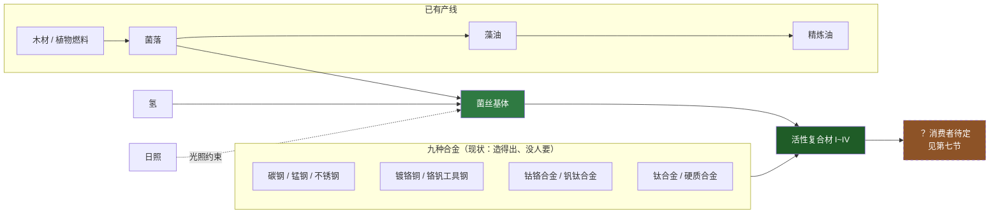
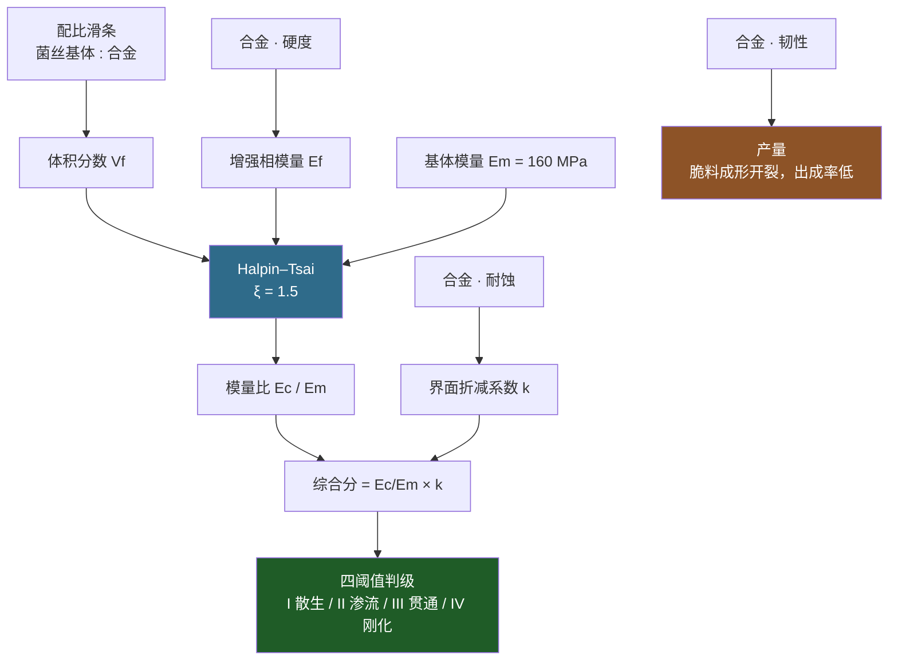

# 活性复合材 V1

> 设计稿。**尚未实现**，写下来是为了把依据钉住，实现时照着填 `//` 注释。
> 本文引用的论文见文末，每条数值旁标了出处编号。

---

## 零、一句话

```
菌落 + 光照 + 氢气 ──→ 菌丝基体 ──+ 任一合金──→ 活性复合材（四级）
```

**这条链只有一处是编的。** 第一步（光合-氢营养积累聚酯基体）是文献里有专名的
真实培养模式；第二步（菌丝支架长进无机相形成杂化活体材料）也是 2023–2024 年的
真实工作。编造的只有一件事：**它能长进金属而不只是长进砂石与陶瓷**。

这符合仓库的口径——口径要求的不是"不许编"，而是"数要推得出来，并把锚点写进注释"。
所以做法是：**输入全部保持真实，只编一个前提，然后把那个前提当成新锚点。**

---

## 一、它解决什么问题

CLAUDE.md 的「已知空缺」里点名了一条：

> **合金存在但没有任何东西消费它。** 九种全都做出来了，但会*使用*它们的
> 谓词驱动配方还没写。在那之前，合金可造而无用——**这是成本检查唯一抓不到的
> 那种死内容**，因为它只比较材料之间强弱，从不问有没有东西想要它。

活性复合材就是冲这个空缺来的：**一条配方吃任意一种合金**，九种合金第一次有了共同的去处，
而且哪一种更合适是有判据的，不是随便挑。

---

## 二、总览



两步都跑在**生物温室**（`ERecipeType` 11，生化培养）里，不新增建筑。理由见第五节。

---

## 三、第一步：菌丝基体

### 3.1 依据：这一步几乎不用编

「光合-氢营养」（photohydrogenotrophic）是紫色非硫细菌的一种**有专名的标准生长模式**。
2024 年的工作测了 *Rhodomicrobium* 在四种光合条件下积累聚羟基脂肪酸酯（PHA，一类生物聚酯）
的产率，发现**光合-氢营养条件下的电子产率最高，达 58.89%，是四种里最高的** [1]。
紫细菌拿 H₂ 当无机电子供体是教科书内容 [3]。

**氢在这里不是碳源，是"多余的电子"。** 这一点值得单独说，因为它解释了为什么加氢会
*促进*基体产量而不是稀释它：PNSB 走光合异养时，碳源往往比菌体本身更还原，细胞里会出现
还原力过剩，必须找地方排掉；文献把这些去处统称为 "electron sinking" 策略，而
**PHA 合成正是其中一条** [2]。所以

> 氢 → 还原力过剩 → 细胞被迫把碳往聚酯里堆 → 基体产量上去

是文献里的因果，不是为了让配方好看编的。

### 3.2 配方

| | |
|---|---|
| 名称 | **菌丝基体 · 光合氢营养** |
| 机器 | 生物温室（type 11） |
| 原料 | 菌落 ×4 + 氢 ×9 |
| 产物 | 菌丝基体 ×2 + 水 ×6 |
| 耗时 | 5 秒（300 tick） |

**系数怎么来的。** 纯光合自养产 PHB 的总反应是配平的：

```
4 CO₂ + 9 H₂ ──光──→ C₄H₆O₂ + 6 H₂O
```

（核对：C 4/4，H 18 = 6+12，O 8 = 2+6 ✓）

游戏里碳源不是 CO₂ 而是菌落，所以**保留氢与水的系数 9 和 6，把 4 份 CO₂ 换成 4 份菌落**。
这是一次替换而不是一次发明：碳的来源变了，电子账没变。

> **和藻菌共培养那条一样，这不是严格配平的方程式。** 生物量不是化合物、没有固定
> 化学式，写不出严格系数——同样的说明已经写在 `ores.json` 的共培养条目里，
> 这里沿用同一个先例（另见"钒块 · 残渣提取"）。

### 3.3 物品属性

| 字段 | 值 | 依据 |
|---|---|---|
| `isFluid` | false | 收获后是含水的聚酯-菌丝团块，不是液体 |
| `fuelType` / `heatValue` | **都不给** | 见下 |
| `stackSize` | 300 | 全仓库统一的平衡旋钮，不做化学解释 |

**为什么不给热值，尽管它确实能烧。** PHB 的质量热值约 21 MJ/kg，煤约 24 MJ/kg，
按仓库的质量基准折算约 **2.4 MJ**——数字记在这里，省得下次重推。但**故意不配**：
给了它热值，整条链就多出一条"氢 → 基体 → 烧掉"的绕路，而直接烧氢（原版 8 MJ）
永远更划算，这条支路一出生就是死的。它是结构材料，不是柴火。

---

## 四、第二步：活性复合材

### 4.1 依据

- **菌丝当矿化支架做活体工程材料（ELM）是 2024 年的工作** [4]：菌丝支架由真菌自身或
  产脲酶细菌矿化，存活四周以上，并用它做出了仿骨单位（osteon）的内部结构。
- **目前最强的菌丝复合材**：模量 160 MPa、抗拉 0.72 MPa，较典型菌丝复合材**提升 15 倍**；
  论文自己用的词就是 "hybrid-living materials" [6]。
- **光照可以直接调控矿化程度**：光诱导生物膜梯度矿化，矿化后杨氏模量最高**提升 15 倍**，
  且细胞保持存活、能感知并响应环境 [5]。
- **菌丝复合材的短板正是内部结合强度**，而加入细菌纤维素这类有机添加剂能显著改善内部结合，
  并让力学性能变得**可调** [16]——这给"菌落既是活体又是粘结剂"提供了实验依据。
- 界面那一侧：海洋菌群在**钢**表面原位矿化出方解石涂层，腐蚀速率降低 >95%，
  并具备**主动自修复** [15]；真菌与金属的吸附、累积、转化乃至**合成金属纳米颗粒**有完整综述 [18]。

**"同一份培养体 + 不同基材 = 不同材料"两侧都有支持**，这是整条分级机制的地基：

- *实验侧*：同一种真菌换基材、换菌种、换压制工艺，密度、拉伸、抗弯全变，性能从泡沫状
  一路移到**软木和木材** [11]；五种纤维的干密度、杨氏模量、压缩刚度、应力-应变曲线
  有完整数据 [12]；70 多种真菌的选种指南列了 11 条特征，可用于对应"哪种合金更合适" [17]。
- *理论侧*：反应扩散模型表明菌丝网络的宏观形态**可以纯由环境决定而非基因** [10]——
  也就是说"同一个菌落配不同合金得到不同等级"不需要设定成不同的菌种，
  它本来就是同一套生物在不同基材上的自组织结果。

**编造的那一句，只有一句：** 这种共生体分泌的骨架能沿**金属**晶界生长并与之互锁，
而不只是把砂石与碳酸钙黏在一起。上面每一篇都做到了"生物体 + 无机相"，没有一篇做到
"生物体 + 金属基体"。这就是这条链的虚构前提，**其余全部由文献推导**。

### 4.2 为什么是四个等级——出处是一篇纯理论论文

*ACS Nano* 上研究碳纳米管网络载荷传递的图论工作发现：交联密度存在**三个临界阈值**，
把载荷传递分成**四种模式** [7]：


四个等级就叫这四个名字。**这不是拍出来的四档，是三个阈值切出来的四段。**

同一篇论文还给了一条可以直接用的机制：交联数呈**幂律分布**，存在**择优连接**——
交联多的纤维更容易再长交联。换句话说高等级天然更难达到，而且是加速难的。

菌丝网络本身也有建模侧的背书：三维菌丝分枝与**融合（anastomosis）**的高性能模拟 [8]，
以及一个以真菌菌丝为灵感的空间网络最小模型，自发涌现"主干 + 分枝"结构 [9]。

### 4.3 等级怎么算：Halpin–Tsai + 界面折减

仓库已有的四维属性（硬度 / 韧性 / 耐蚀 / 导电）各自派不同的活，**不是加权求和**：



**Halpin–Tsai** 是短纤维/颗粒增强复合材预测刚度的标准半经验模型：

```
η    = (Ef/Em − 1) / (Ef/Em + ξ)
Ec/Em = (1 + ξ·η·Vf) / (1 − η·Vf)
```

- `Em = 160 MPa`：取实测最强菌丝复合材的模量 [6]
- `ξ = 1.5`：不是原始论文的 2。有限元研究表明，放弃"纤维在横截面上正方排列"这个
  原始假设、改用随机分布后，**ξ = 1.5 才是常见体积分数下的更好估计** [19]
- `Ef`：由合金硬度映射。硬度是四维里最接近模量的一维
- `Vf`：由每台建筑的配比滑条决定

**滑条上限有文献依据。** 校准过的 Halpin–Tsai 框架覆盖 Vf 到 0.80，并明确指出
**刚度增益在 Vf ≈ 0.60–0.70 开始饱和**，再往上加增强相，收益相对制造复杂度已经不划算 [13]。
所以滑条的"甜点"在 0.6~0.7，越过之后要花掉明显更多的稀有合金才换到一级——
这是**有出处的收益递减**，不是平衡性拍脑袋。

**为什么还要界面折减这一项。** Halpin–Tsai 在高刚度比下会对 `Ef` 钝化：硬度 50 和
硬度 90 的合金在同一配比下综合分只差不到 5%，等级几乎完全由滑条决定，那样"选哪种合金"
就成了假选择。真实复合材的失效也确实主要在界面而非增强相——菌丝复合材的公认短板
正是内部结合强度 [16]。所以引入 `k`（由耐蚀决定，范围 0.5~1.0），让**选材和调配比
各管一半**，同时也是对 [15][18] 那条"金属-微生物界面"的呼应。

**韧性走产量，不走等级。** 脆料在成形时开裂、每炉出成率低——这个判据仓库里已经有了，
合金弹药的 `pair → yield` 用的就是它，这里沿用同一条，不新发明。

### 4.4 阈值取值：**先枚举再定，不预设**

```
I  散生    score <  2.0
II 渗流    2.0 ≤ score <  3.5
III 贯通   3.5 ≤ score <  5.5
IV 刚化    score ≥  5.5
```

**这四个数是占位符。** 仓库已有的做法是注册时枚举全部可达配比、记录
`QMin`/`QMax` 再归一化（`AlloyRatioPatches.Calibrate`），并把最优/最差配比连同
它换来的产量和耗时打进日志，那行日志同时充当验收检查。这里照抄那套：
**九种合金 × 滑条网格全枚举一遍，确认四个等级都够得着、且没有哪一级是空的**，
再把阈值钉进 `alloys.json`。

抄这套还有第二个理由：仓库记过一条实测结论——不同合金的原始品质跨度差别极大
（锰钢端到端移动 23%，钒钛只有 1%），不归一化就会有几个滑条是死的。

### 4.5 光照要不要再乘一次？——**不乘**

[5] 说矿化程度由光调控、矿化后模量提升 15 倍，看上去很适合把日照强度乘进综合分。
**但生物温室整座建筑已经受日照约束**（满日照满产、零日照停工），再乘一次就是同一个
物理量在同一条链上收两次费。

所以 [5] 在这里的作用是**论证这条链凭什么放进一座看天吃饭的建筑**，
而不是再当一个乘数。记下来，免得日后有人觉得"漏了一个光照项"。

---

## 五、落在哪台机器上

**两步都在生物温室（`ERecipeType` 11）。** 三条理由：

1. **它本来就是生化培养。** 这两步都是培养体在干活，不是化学反应，机器与反应类别自洽——
   和"酯交换不是氧化还原所以留在原版化工厂"是同一条判据。
2. **光照约束是免费的。** 生物温室已经按建筑受日照约束，第一步需要光（光合），
   第二步的矿化也是光调控的 [5]，两步都放进去，不需要任何新机制。
3. **不新增建筑。** 没有新图标、没有新建模、没有新的建造栏格位。

代价：合金要送进温室。温室有 12 个传送带口 + 自带行星内物流站，不是问题。

---

## 六、实现要点

### 6.0 怎么做的：一条配方 + 选料行 + 配比滑条

**6 种填料 × 4 个等级 = 24 种组合，合成面板上只占一格。**
技术和合金弹药同一套：`requires[i]` 是 `int`，逐台建筑改它就能让同一条配方吃不同原料。

```
一条 RecipeProto「活性复合材 · 菌丝共生」   ← 合成面板里只有这一格
  requires[0] / requireCounts[0] = 菌丝基体 × (10 − n)
  requires[1] / requireCounts[1] = 玩家选的合金 × n     ← 选料行
  products[0]                    = n 落在哪一段就是哪一级 ← 配比滑条
  productCounts[0]               = 产量，按填料韧性的递减回报算
```

**面板是合金配比那一块的第三种模式**，不是新画的：
`LayoutRow(row, picker)` 本来就是**按行**切换滑条 / 选择器的外观，
所以"第一行选择器 + 第二行滑条"同屏不需要动它——这是这块面板此前没组合过的用法。

| 行 | 控件 | 交互 | 为什么是这种 |
|---|---|---|---|
| 0 | 选料行 | **点**左右半边翻 | 合金是离散的；拖会一路扫过中间那些值，每扫一个触发一次 `Apply` |
| 1 | 配比滑条 | **拖** | 配比是连续量，而且要能一路扫过去看等级怎么变 |

**等级由配比推出来，不单独选。** 这是物理口径不是省事：Halpin–Tsai 在高刚度比下
对填料模量钝化，硬度 50 与 90 的合金在同一配比下综合分差不到 5%，
**配比才是等级的主要杠杆，填料种类是次要的**。滑条两端各留一份——
全是基体或全是合金的配方没有意义。

配比 → 等级（`composite.json` 的 `minParts`）：

| 合金份数 | 1–2 | 3–4 | 5–6 | 7–9 |
|---|---|---|---|---|
| 等级 | I 散生 | II 渗流 | III 贯通 | IV 刚化 |

**六种填料**：锰钢、不锈钢、镀铬铜、铬钒工具钢、钴铬合金、钒钛合金。
硬质合金**不在其中**——它自己有一套 WC:Co 配比面板，再叠一层选料会有两块面板抢同一个窗口；
碳钢（原版钢材）和钛合金是原版物品，留给原版产线。

### 6.1 存档与再贴

逐台建筑的选择存 `AlloyRatioStore`——它本来就是"每台建筑一个 `int[]`"，
这里存 `{ 合金物品 ID, 合金份数 }`，形状和弹药那对合金 ID 一样，**SaveVersion 不用动**。

**三家共用一个 Store 是安全的**：每家的 `Locate` 都先核对 `recipeId`，
不是自己的机器直接 no-op。`ReapplyAll` 挂在和合金配比同样的两个点上
（`GameData.Import` 的后置 + `ProjectEdenPlugin.Import` 的末尾）——
只挂前者会在 DSPModSave 把存档块交回来之前就跑完，什么都贴不上。

### 6.2 ID 预留

| | ID | 备注 |
|---|---|---|
| 菌丝基体 | 物品 6619 | |
| 活性复合材 I~IV | 物品 6620~6623 | |
| 菌丝基体 · 光合氢营养 | 配方 6605 | |
| 活性复合材 · 菌丝共生 | 配方 6606 | 一条，产物按建筑变 |

**避开 6591–6593 与 6600–6611**——那批是合金牌号删除时释放的，只能在新档里复用。
配方 6600 已被合金弹药占用，6601–6604 是生物温室现有的四条。

### 6.3 UI 与引擎侧的既有约束

- **产物侧原版写死 2**，`MultiProductUIPatches` 已经把它扩到 3+，第一步的
  "基体 + 水"两产物无压力。
- **原料侧按 `served.Length` 循环**（`ldlen`，无上限），两原料无压力。
- **五个新物品会溢出到第 14 列以后**，靠物品选择器的搜索框够到；
  拾取过滤器和信号选择器仍然画不出它们（已知空缺，不是本功能引入的）。

### 6.4 一件做不到的事，先说死

**"会自己长的材料"实现不了。** 最诱人的表现是放在仓库里自己变多、或者带着自己的
成熟度——**每件货物带不了元数据**，`Cargo` 是满满 32 字节，CLAUDE.md 里有完整分析
（合金四维属性、弹药等级撞的都是这堵墙）。

所以文献里那些"自再生"结果——蓝细菌活体建材**从一份亲代连续再生三代** [14]、
工程菌硅基复合材**能从一小块整体再生** [20]——在游戏里只能表达成**一条配方**
（复合材 + 菌落 + 氢 → 更多复合材），不能表达成物品自己的属性。

同理，`AssemblerComponent.Export` 按 `requires` / `products` 的**长度**决定写多少
`served` / `produced`，所以**等级必须是预注册的固定物品集合**，不能是"一个连续的品质值"。

---

## 七、唯一还没定的事：谁消费它

论文给足了"怎么造"，没给"造来干嘛"。**这个必须先答**，否则活性复合材会精确地变成
它本来要消灭的那种死内容。三个方向：

| 方向 | 好处 | 代价 |
|---|---|---|
| **A. 接进原版高级物品** | 天然有下游，零新建筑零新科技 | 要挑一个不至于破坏原版节奏的瓶颈 |
| **B. 喂给本 mod 的合金弹药** | 两个系统串起来，弹药档位多一条升级路 | 弹药已经"有没有钨"近乎二元，可能更极端 |
| **C. 自再生**（[14][20] 有出处） | 可引、好玩 | **它本身不是消费者**，仍然要接 A 或 B |

C 可以和 A/B 并存，但不能单独存在。

---

## 八、数值总表（待标定）

| 配方 | 机器 | 原料 | 产物 | 耗时 |
|---|---|---|---|---|
| 菌丝基体 · 光合氢营养 | 生物温室 | 菌落 ×4 + 氢 ×9 | 菌丝基体 ×2 + 水 ×6 | 5 秒 |
| 活性复合材 · 菌丝共生 | 生物温室 | 菌丝基体 ×N + 合金 ×M | 活性复合材 I~IV ×? | 待定 |

`N : M` 由配比滑条决定，`Vf = M / (N + M)`，建议范围 0.2~0.8，甜点 0.6~0.7 [13]。
产物等级与数量按 4.3 计算，阈值按 4.4 枚举标定。

---

## 九、四轴属性怎么定

### 9.1 不做阶梯，做帕累托前沿

最省事的做法是 I < II < III < IV 四轴全递增。**那样前三级全是死内容**，
只能靠 `cost` 列辩护"更贵但更强"——而 `cost` 至今没实现。

这条链不需要靠那个救，因为 4.2 那四种模式**本来就不是"强弱四档"，
是网络连通度这一条轴上的四个状态**，而连通度带来的是权衡，不是单调提升：

| 物理事件 | 正面 | 负面 |
|---|---|---|
| 交联变密 → 载荷传得过去 | 硬度 ↑ | **韧性 ↓**——网络刚化之后再没有耗散能量的机制 |
| 金属相渗流 → 出现连续通路 | 导电 ↑ | 耐蚀随填料而定，不随连通度单调 |

第一条在仓库现有的表里已经看得见：碳化钨 95/10、硬质合金 90/11 对锰钢 50/80、铜块 12/70。
硬度与韧性的反相关不是这条链引入的，是这张表本来的性格。

### 9.2 三条硬约束（实现时才发现的，以后加等级照着来）

**这三条不是平衡口径，是物理口径**，违反哪一条都会立刻出问题：

1. **硬度 ≤ 填料的硬度**
2. **导电 ≤ 填料的导电**
   —— 基体这两项都接近零，混合只会把值往下拉，复合材不可能比增强相更硬或更导电。
3. **韧性 > 填料的韧性**
   —— 韧性是基体唯一确定贡献的一维。**不满足这条，不如直接用那块合金**，
   复合材就成了死内容。第一版 III 的韧性给了 48、低于填料钴铬的 55，
   脚本当场报出"被钴铬合金支配、被钛合金支配"。

### 9.3 数值（已落地）

**这四行是标称值**——四轴属性挂在 `ItemProto` 上，是固定的。表里的"标称填料"是算这组数
用的代表性填料，**不是这一级只能用它**：六种填料都能做四级，面板里显示的是当前组合的实时值。

| | 标称填料 | Vf | 硬度 | 韧性 | 耐蚀 | 导电 | `cost` |
|---|---|---|---|---|---|---|---|
| **I 散生** | 锰钢 50/80/15/10 | 0.2 | 15 | **88** | 68 | 4 | 6 |
| **II 渗流** | 镀铬铜 25/60/75/80 | 0.4 | 22 | 76 | 72 | **38** | 7 |
| **III 贯通** | 钴铬合金 65/55/95/15 | 0.6 | 55 | 62 | **85** | 12 | 9 |
| **IV 刚化** | 硬质合金 90/11/82/14 | 0.8 | **82** | 18 | 80 | 13 | 12 |

逐条：

- **I 的韧性 88 破了表里的纪录**（现纪录锰钢 80），而硬度 15 几乎垫底。极端角落材料，不是"低级货"。
- **II 的硬度只比 I 高 7 点，导电却从 4 跳到 38**——**电学渗流先于力学渗流**。
  导电只需要一条贯穿路径，刚度需要承载连通性。这是全表最该解释的一个数 [7]。
- **II 的导电 38 远低于填料镀铬铜的 80**：填了金属的聚合物相对聚合物跳几个数量级，
  但永远赶不上金属本身。给到 80 就是吹牛。
- **每一级的韧性都高于自己的填料**（88>80、76>60、62>55、18>11），这是约束 3。

### 9.4 一处被实现推翻的说法

> **初稿说**：活性复合材"填上了这张表唯一的空角——又硬又导电"。
> **实现时发现这是错的，而且错得很具体。**

按约束 1、2，复合材要做到"硬度 85 + 导电 55"，填料必须同时硬度≥85、导电≥55。
脚本扫了九种合金：

```
III 贯通 需要填料 硬度≥60 且 导电≥45 → 合格的合金：一种都没有
IV 刚化 需要填料 硬度≥85 且 导电≥55 → 合格的合金：一种都没有
硬度榜首 硬质合金（导电 14）／ 导电榜首 镀铬铜（硬度 25）
```

那个角落**填不了**，而且原因恰恰是"它是空的"——它空着，是因为没有任何合金站在那里，
所以也没有任何填料能把复合材送上去。**声称填补一个空角，却要靠那个空角里的东西当原料，
是循环的。**

它真正占的位置是另一个：**同等硬度下韧性远高于任何金属**。
IV 的 82/18 对硬质合金的 90/11——硬度只低 8 点，韧性高 64%；
I 的 15/88 对铜块的 12/70——硬度相当，韧性高 18 点。
这才是基体真正买来的东西。

### 9.5 四级之间两两不互相支配

六对全部通过（脚本核过）：

| 对比 | 前者赢 | 后者赢 |
|---|---|---|
| I ↔ II | 韧性 88>76 | 硬度、耐蚀、导电 |
| I ↔ III | 韧性 88>62 | 硬度、耐蚀、导电 |
| I ↔ IV | 韧性 88>18、耐蚀 68<80… 见下 | 硬度、耐蚀、导电 |
| II ↔ III | 韧性 76>62、导电 38>12 | 硬度、耐蚀 |
| II ↔ IV | 韧性 76>18、导电 38>13 | 硬度、耐蚀 |
| III ↔ IV | 韧性 62>18、耐蚀 85>80 | 硬度、导电 |

（I 对 IV 只靠韧性一维取胜——88 对 18——但支配要求**四维全不差**，一维赢就足以不被支配。）

**没有一级会因为另一级的存在而变成死内容，而且这个结论不依赖 `cost` 列。**

### 9.6 对现有 18 种的支配检查：两处，都要 `cost` 背书

| 支配 | 被支配者 |
|---|---|
| II 支配**铁块**（20/60/10/20） | 铁块 `cost` 约 1，II 是 7 |
| III 支配**钒块**（45/30/65/10） | 钒块 `cost` 5，III 是 9 |

都是"更贵但更强"，按 CLAUDE.md 的判据属于正当深度——**但那要 `cost` 列真的存在才算数。**

> **附带发现，值得记进「已知空缺」：** `cost` 一直是"设计了没实现"，
> 因为此前没有哪条内容真的需要它。**活性复合材是第一个真正需要它的功能。**

### 9.7 两件已经处理掉的事

**1. 表里这四行是标称值。** 四轴属性挂在 `ItemProto` 上，是固定的——合金那边已经撞过这堵墙。
四条物品描述末尾都写了"四轴是标称值，实际随所用合金与配比变化"。

**2. 四轴不只是显示，它已经在喂一个机制。** 合金弹药的穿透分是 `硬度×0.85 + 耐蚀×0.15`。
按上表 IV 算出来 **82×0.85 + 80×0.15 = 81.7**，略高于铬钒工具钢的 77.0，低于碳化钨的 93.5。
如果日后让它进弹药链，这是它会落到的档位。

## 十、参考文献

第一步（光合-氢营养与聚酯基体）

1. Conners et al. 2024. *The phototrophic purple non-sulfur bacteria Rhodomicrobium spp. are novel chassis for bioplastic production.* Microbial Biotechnology. DOI: 10.1111/1751-7915.14552
2. Alloul et al. 2022. *Dehazing redox homeostasis to foster purple bacteria biotechnology.* Trends in Biotechnology. DOI: 10.1016/j.tibtech.2022.06.010
3. Madigan et al. 2008. *An Overview of Purple Bacteria: Systematics, Physiology, and Habitats.* DOI: 10.1007/978-1-4020-8815-5_1

第二步（菌丝支架、活体杂化材料、界面）

4. Viles et al. 2024. *Mycelium as a scaffold for biomineralized engineered living materials.* bioRxiv. DOI: 10.1101/2024.05.03.592484
5. Wang et al. 2020. *Living materials fabricated via gradient mineralization of light-inducible biofilms.* Nature Chemical Biology. DOI: 10.1038/s41589-020-00697-z
6. Shen et al. 2023. *Robust myco-composites: a biocomposite platform for versatile hybrid-living materials.* Materials Horizons. DOI: 10.1039/d3mh01277h
15. Yang et al. 2026. *In Situ Fabrication of Calcium Carbonate Mineralized Coatings by Marine Microorganisms for Corrosion Protection, Anti-Icing, and Self-Healing.* Advanced Functional Materials. DOI: 10.1002/adfm.202529038
16. Elsacker et al. 2021. *Mechanical characteristics of bacterial cellulose-reinforced mycelium composite materials.* Fungal Biology and Biotechnology. DOI: 10.1186/s40694-021-00125-4
18. Priyadarshini et al. 2021. *Metal-Fungus interaction: Review on cellular processes underlying heavy metal detoxification and synthesis of metal nanoparticles.* Chemosphere. DOI: 10.1016/j.chemosphere.2021.129976

分级判据（**纯理论 / 建模**）

7. Ji et al. 2022. *Revealing Density Thresholds of Carbon Nanotube Cross-Links for Load Transfer: A Graph Theory Strategy.* ACS Nano. DOI: 10.1021/acsnano.2c03003 —— **四个等级的出处**
8. Palmer et al. 2025. *Three-dimensional modeling of hyphal fusion, branching, and nutrient transport in filamentous fungi.* Physical Review E. DOI: 10.1103/xbjp-zqj1
9. Barthelemy 2025. *From lines to networks.* Physical Review E. DOI: 10.1103/4xnv-h9dc
10. Davidson et al. 1996. *Context-dependent macroscopic patterns in growing and interacting mycelial networks.* Proc. R. Soc. B. DOI: 10.1098/rspb.1996.0129 —— 宏观形态可由环境而非基因决定，即"同一个菌落配不同合金得到不同材料"的机理
13. Zengah et al. 2026. *Micromechanical Prediction of Elastic Properties of Unidirectional Glass and Carbon Fiber-Reinforced Epoxy Composites Using the Halpin–Tsai Model.* Polymers. DOI: 10.3390/polym18070822 —— **Vf 0.60–0.70 刚度增益饱和**
19. Giner et al. 2015. *Estimation of the reinforcement factor ξ for calculating the transverse stiffness E2 with the Halpin–Tsai equations using the finite element method.* Composite Structures. DOI: 10.1016/j.compstruct.2015.01.008 —— **ξ = 1.5**

菌丝复合材的实测性能（"同一培养体 + 不同基材 = 不同材料"的实验侧）

11. Appels et al. 2019. *Fabrication factors influencing mechanical, moisture- and water-related properties of mycelium-based composites.* Materials & Design. DOI: 10.1016/j.matdes.2018.11.027
12. Elsacker et al. 2019. *Mechanical, physical and chemical characterisation of mycelium-based composites with different types of lignocellulosic substrates.* PLoS ONE. DOI: 10.1371/journal.pone.0213954
17. Sydor et al. 2022. *Fungi in Mycelium-Based Composites: Usage and Recommendations.* Materials. DOI: 10.3390/ma15186283

自再生（游戏里只能做成配方，见 6.4）

14. Heveran et al. 2020. *Biomineralization and Successive Regeneration of Engineered Living Building Materials.* Matter. DOI: 10.1016/j.matt.2019.11.016
20. Kang et al. 2021. *Engineering Bacillus subtilis for the formation of a durable living biocomposite material.* Nature Communications. DOI: 10.1038/s41467-021-27467-2
